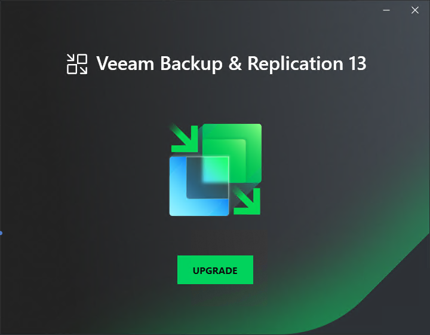

In this article

To start the upgrade wizard, take the following steps:

1. Download the latest version of the Veeam Backup & Replication installation image from the [Veeam Product Downloads](https://www.veeam.com/downloads.html) page.
2. Mount the installation image to the machine where Veeam Backup Enterprise Manager is installed, or burn the image file to a flash drive or other removable storage device. If you plan to upgrade Veeam Backup Enterprise Manager on a VM, use built-in tools of the virtualization management software to mount the image to the VM.

To extract the content of the ISO file, you can also use the latest versions of utilities that can properly extract data from ISO files of large size and can properly work with long file paths.

1. After you mount the image or insert the disk, Autorun opens a splash screen. If Autorun is not available or disabled, run the Setup.exe file from the image or disk.
2. Click Upgrade.

Page updated 10/29/2025

Page content applies to build 13.0.1.1071
