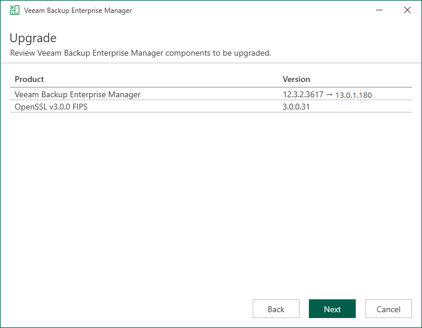

In this article

At the Upgrade step of the wizard, you can review the components that will be upgraded.

Click Next to begin the upgrade process. Wait for the upgrade process to complete and click Finish to exit the wizard.

Page updated 10/29/2025

Page content applies to build 13.0.1.1071
