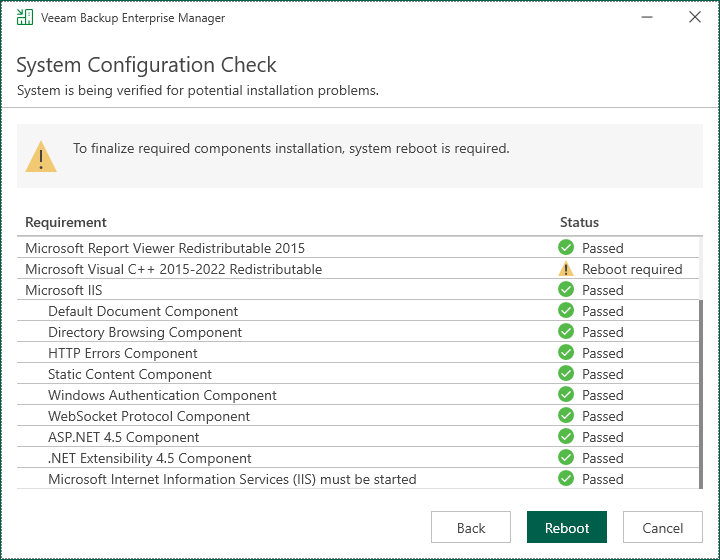

In this article

At the System Configuration Check step of the wizard, the setup checks whether required software is installed on the machine.

* If some of the required components are missing, the setup will try to install them automatically. After the components are installed successfully, reboot is required. When you are ready to reboot the machine, click Reboot.
* If the setup is not able to install some of the required software automatically, install it manually and click Retry.

|  |
| --- |
| Note |
| If all required software is already installed on the machine, the System Configuration Check step will be skipped. For more information on the necessary software, see [System Requirements](system_requirements.md). |

Page updated 10/29/2025

Page content applies to build 13.0.1.1071
