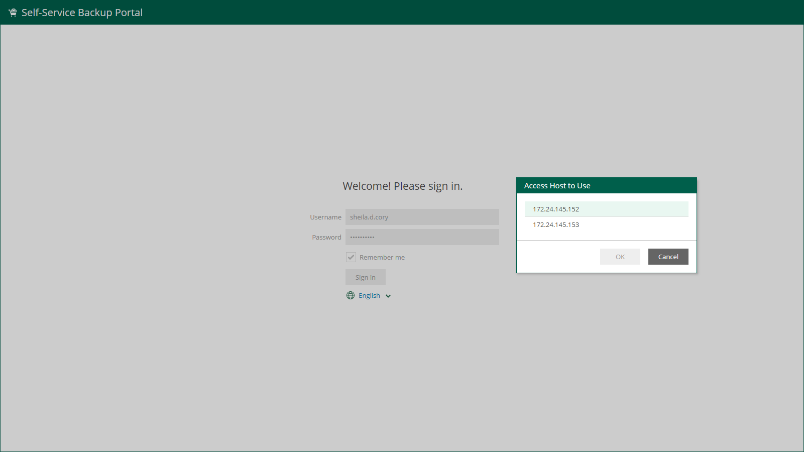

In this article

You can add configurations for VMware Cloud Director organizations created on multiple VMware Cloud Director servers that are added to the Veeam Backup Enterprise Manager infrastructure.

Before you manage Cloud Director organization configurations, check the following prerequisites:

1. The Cloud Director server version must be supported. For more information, see [System Requirements](system_requirements.md#vCD).
2. All Cloud Director servers must be added to the backup infrastructure of backup servers. For more information, see the [Adding VMware Cloud Director](https://helpcenter.veeam.com/docs/vbr/userguide/adding_vcloud_director.html?ver=13) section of the Veeam Backup & Replication User Guide.
3. Backup servers that contain the Cloud Director servers in their infrastructure must be connected to Enterprise Manager. Make sure that the version of Veeam Backup & Replication installed on the backup server matches the version of Enterprise Manager. For more information, see [Managing Backup Servers](managing_backup_servers.md#add).
4. Enterprise Manager must complete data collection from the added backup server. For more information, see [Collecting Data from Backup Servers](collecting_data_from_backup_servers.md).
5. The account that you will use to manage Cloud Director organization configurations must be assigned the Portal Administrator role. For more information, see [Configuring Accounts and Roles](veeam_backup_em_roles.md).

Managing Multiple Cloud Director Servers

You can add Cloud Director organization configurations for multiple Cloud Director servers. In this case, organization members that work with Veeam Self-Service Backup Portal by the portal URL must specify the host of their Cloud Director server when accessing the portal. They can also open the portal from the native VMware Cloud Director environment. For more information, see [Accessing Veeam Self-Service Backup Portal](vcd_portal_access.md).

Members of Cloud Director organizations can access Veeam Self-Service Backup Portal by the following portal URLs:

* Full URL that contains the host address where the necessary Cloud Director server resides:

|  |
| --- |
| https://<EnterpriseManagerServer>/vcloud/<VCDServer>/<OrgName> |

In this case, Veeam Self-Service Backup Portal will open right after clicking the Sign in button.

* Shorter URL that does not contain the host address where the necessary Cloud Director server resides:

|  |
| --- |
| https://<EnterpriseManagerServer>/vcloud/<OrgName> |

In this case, after clicking the Sign in button, Veeam Self-Service Backup Portal will prompt to select a Cloud Director host from the list of available Cloud Director hosts.

If you do not want Cloud Director organization members to see addresses of all Cloud Director hosts added to the Enterprise Manager infrastructure, add each Cloud Director server to a separate Enterprise Manager infrastructure.

Page updated 9/2/2025

Page content applies to build 13.0.1.1071
