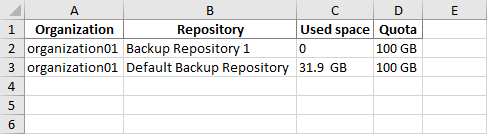

In this article

Users with the Portal Administrator role can export a report with a list of configurations that were created for VMware Cloud Director organizations. The list does not include the default configuration. When you export the report, it is saved as an XLSX file.

To export a configuration report:

1. Log in to Veeam Backup Enterprise Manager using an administrative account.
2. Click Configuration in the upper-right corner.
3. In the Configuration view, select the Self-service section.
4. In the Self-service section, select the Cloud Director tab.
5. On the Cloud Director tab, click Export.

Page updated 10/30/2025

Page content applies to build 13.0.1.1071
