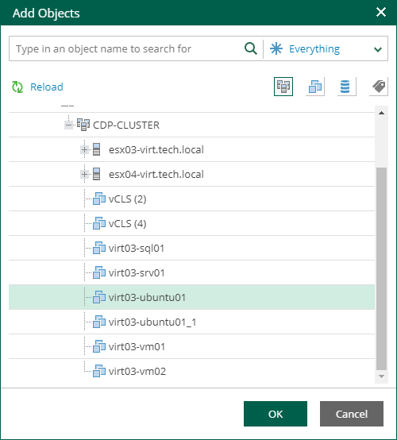

In this article

On the Jobs tab, members of the VMware Cloud Director organization can perform the following operations with Cloud Director backup jobs, replication jobs, and CDP policies:

* [Create backup jobs](cd_creating_jobs.md)
* [Start, Stop and Retry backup jobs and replication jobs](vcd_start_stop_retry_jobs.md)
* [Enable and disable backup jobs, replication jobs, and CDP policies](vcd_enable_disable_jobs.md)
* [Edit backup jobs and replication jobs](editing_job_settings.md)
* [Delete backup jobs, replication jobs, and CDP policies](cd_deleting_jobs.md)

Before You Begin

Before you start working with jobs, consider the following:

* Organization members cannot see jobs and CDP policies created by the service provider in Veeam Backup & Replication if the jobs and policies are not mapped to the organization configuration. For more information, see [Mapping Jobs and CDP Policies to Organization Configurations](vcd_map_jobs_policies.md).
* Job cloning is not available.

* In Veeam Self-Service Backup Portal, you cannot create and edit jobs managed by backup servers of earlier major or minor versions. For example, after you upgrade Enterprise Manager to version 13.0, you will not be able to create and edit jobs managed by a backup server with version 12.3. To resolve the issue, upgrade the backup server as well.

* The following limitations apply to scenario involving VM backup and subsequent restore using Veeam Self-Service Backup Portal:

1. You create a backup job that will process a VM added explicitly (that is, not as a part of a vApp container).
2. This job runs creating a number of restore points.
3. Then you restore this VM to the original location by using the portal.

After restore, the VM identifier changes in Cloud Director hierarchy. Due to this reason, the backup job cannot locate this VM any longer. So, you need to edit job settings, adding this VM anew. To ensure that job configuration will store this VM with the new metadata (not the old one from Cloud Director hierarchy cache), you should first click Reload in the Add Objects window.

1. At the next job run, a new full backup will be created for this VM. However, if you try to perform file-level restore with the portal from the restore points created initially for that VM (on step 2), the restore operation will fail, as that VM identifier does not exist any longer.

Page updated 11/18/2025

Page content applies to build 13.0.1.1071
