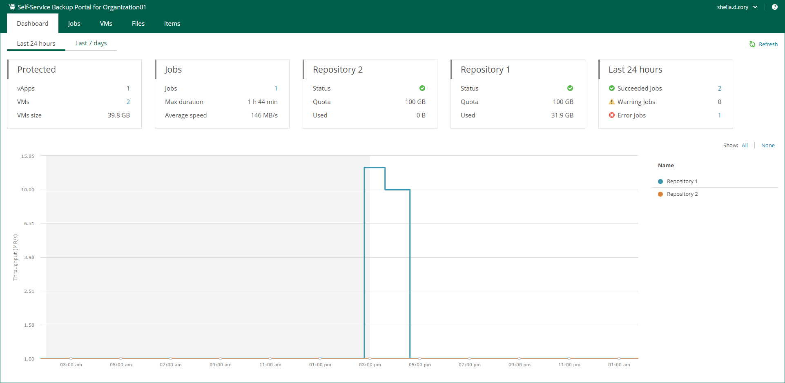
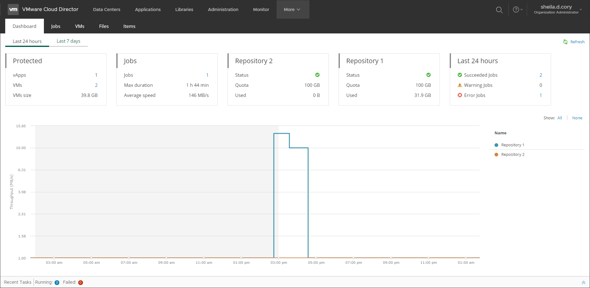

In this article

The Dashboard tab contains statistics on VMware Cloud Director backup jobs, replication jobs, and CDP policies of your Cloud Director organization, including information on protected VMs, job runs, and backup repositories.

You can view the chart for one of the time ranges:

* Last 24 hours
* Last 7 days

To switch between the ranges, select a necessary tab in the upper-left corner.

Veeam Self-Service Backup Portal accessed by URL

Veeam Self-Service Backup Portal accessed from Cloud Director using Veeam Plug-in for VMware Cloud Director

The Protected widget contains the following information:

* vApps — the number of vApps for which restore points were successfully created during the specified period.
* VMs — the number of VMs for which restore points were successfully created during the specified period.
* VMs size — total size of source VMs successfully processed.

The Jobs widget contains the following information:

* Jobs — the number of created jobs.
* Max duration — maximum job duration.
* Average speed — average data transfer speed.

The Backup Storage / <Repository name> widgets display statistics about backup repositories available to the organization. Each widget represents a single repository and contains the following information:

* Status — a status of the backup repository assigned to the organization:

* Green — more than 10% of storage space is free.
* Yellow — less than 10% of storage space is free.
* Red — no free space on backup storage.

* Quota — storage quota.
* Used — used storage size. Note that replication jobs do not consume storage quota of backup repositories because replicas are stored on the target VMware Cloud Director VDC.

The Last 24 hours / Last 7 days widget reports on the job session results for the selected period.

To visualize on-going jobs data, the Dashboard tab also comprises a chart showing date and time when jobs were performed, and the network throughput rate during the job.

The highlighted part of the chart represents the configured backup window if this option is specified in the chart settings. For more information, see [Customizing Dashboard Chart](customizing_dashboard_chart.md).

Page updated 10/30/2025

Page content applies to build 13.0.1.1071
