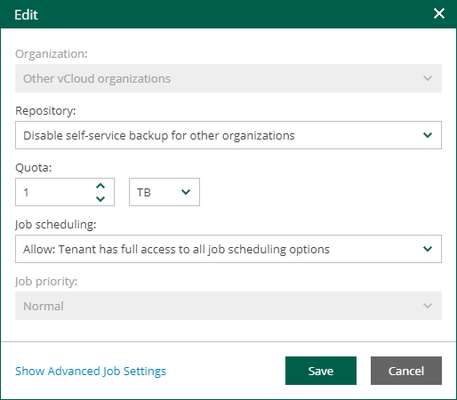

# Viewing Organization Configurations

In Veeam Backup Enterprise Manager, users with the Portal Administrator role can view the list of configurations for VMware Cloud Director organizations.

To view the list of organization configurations:

1. Log in to Veeam Backup Enterprise Manager using an administrative account.
2. Click Configuration in the upper-right corner.
3. In the Configuration view, select the Self-service section.
4. In the Self-service section, select the Cloud Director tab.

Veeam Backup Enterprise Manager offers a default configuration that you can use for Cloud Director organizations. The configuration is applied to each organization that does not have a specific configuration added for it.

The default configuration contains the following parameters:

* Organization — Other VMware Cloud Director organizations
* Repository — Disable self-service backup for other organizations

Initially the default configuration is not active. To enable it, select a repository for the configuration.

* Quota — 1 TB
* Job scheduling — Allow: Tenant has full access to all job scheduling
* Job priority — Normal

For more information on configuration parameters, see [Adding Organization Configuration](em_configure_vcd_org.md).

