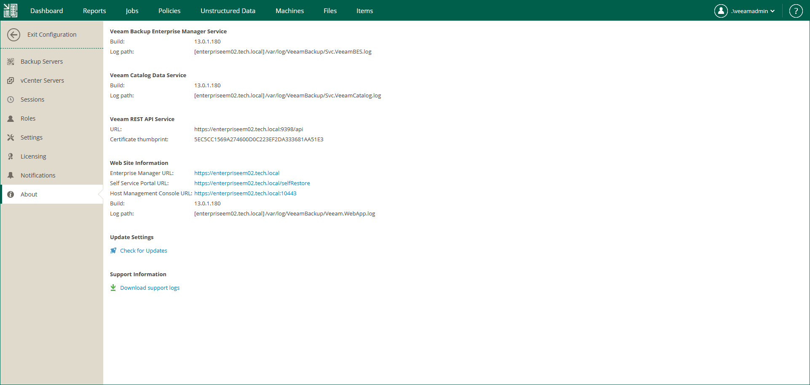

# Viewing Information About Enterprise Manager

You can view detailed information about Enterprise Manager and its components, including the URLs of the Veeam Backup Enterprise Manager REST API, Veeam Self-Service File Restore Portal, Host Management Console (for Linux-based Enterprise Manager). Additionally, you can download the Enterprise Manager logs for [Veeam Customer Support](https://www.veeam.com/support.html). For details, see [Enterprise Manager Logs](em_logs.md).

To view information about Enterprise Manager, do the following:

1. Log in to Enterprise Manager using an administrative account.
2. To open the Configuration view, click Configuration in the upper-right corner.
3. Open the About section on the left of the Configuration view.

