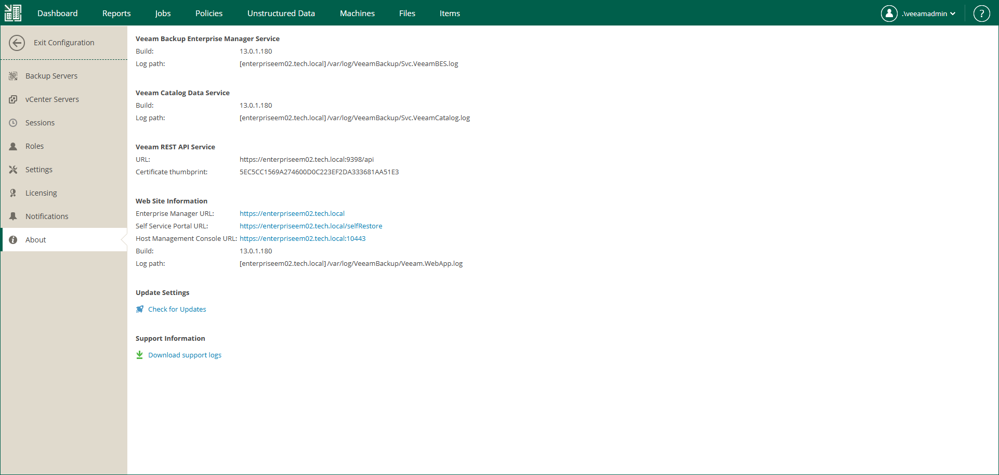

# Viewing Information About Enterprise Manager

In the About section, you can check the product version and find links to Veeam Updater, Veeam Host Management, Veeam Self-Service File Restore Portal, and resources that can help you resolve issues with Enterprise Manager. You can also download Enterprise Manager logs for [Veeam Customer Support](https://www.veeam.com/support.html). For more information, see [Enterprise Manager Logs](em_logs.md).

To view information about Enterprise Manager, do the following:

1. Log in to Enterprise Manager using an account with the Portal Administrator role.
2. In the upper-right corner, click Configuration.
3. In the Configuration view, open the About section.

Page updated 2026-07-16

