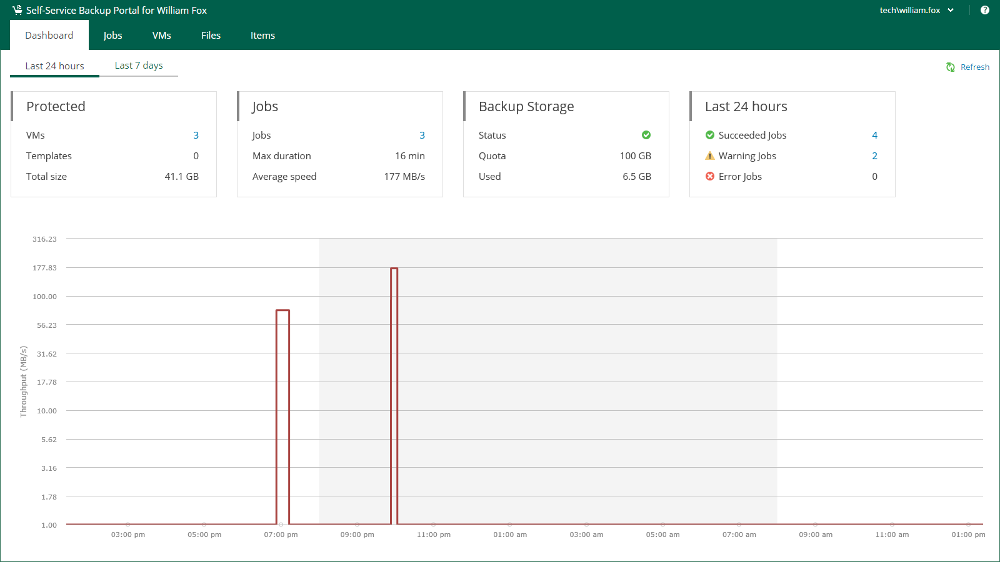

# Viewing Self-Service Backup Portal Statistics

The Dashboard tab contains statistics on tenant backup infrastructure, including information about protected VMs, backup jobs, backup storage and the number of jobs that completed successfully, finished with warnings and errors. You can view statistics for the last 24 hours or last 7 days. To switch between the views, click Last 24 hours or Last 7 days in the upper-left corner of the working area.

The Protected block displays the following information:

* VMs — number of VMs successfully processed during the selected period. At least one restore point was created for these VMs.
* Templates — number of virtual machine templates successfully protected during the specified period.
* Total size — total size of successfully protected VMs and templates.

The Jobs block displays the following information:

* Jobs — number of jobs created by the currently logged-in user.
* Max duration — maximum job duration.
* Average speed — average data transfer speed.

The Backup Storage block displays the following information:

* Status — status of the backup storage assigned to the user: Green — more than 10% of storage space is free; Yellow — less than 10% of storage space is free; Red — no free space on backup storage.
* Quota — storage quota assigned to the user.
* Used — storage quota used by the user.

The Last 24 hours / Last 7 days block reports on job session results for the selected period.

To visualize on-going job data, the Dashboard tab also comprises a graph showing time and date when jobs were performed, and the network throughput rate during the job.

The highlighted part of the graph represents the configured backup window if this option was specified in the dashboard settings. For more information, see [Customizing Dashboard Chart](customizing_dashboard_chart.md).

