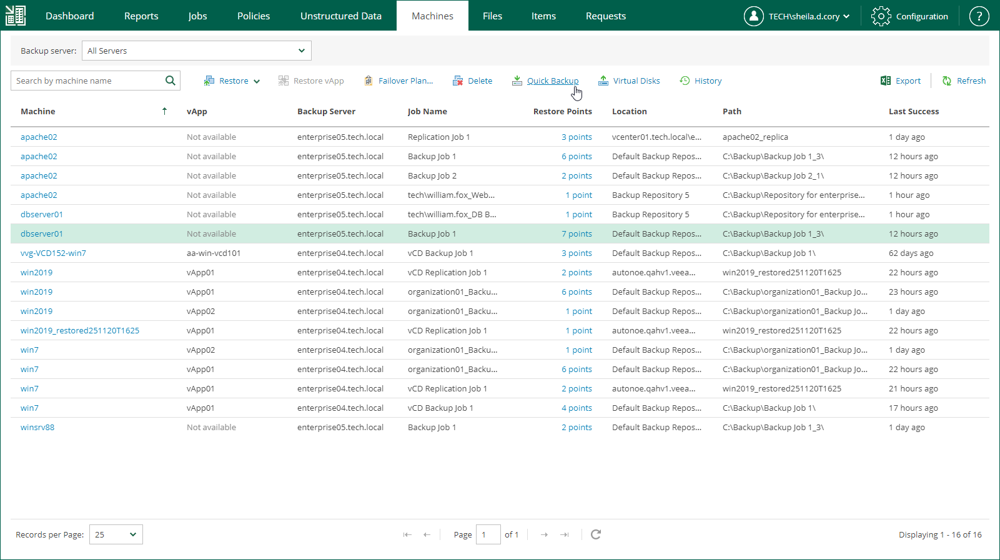

In this article

Quick backup is an ad-hoc incremental backup for a machine added to a backup job. To create a new incremental restore point, Veeam Backup & Replication triggers an existing backup job that processes the selected machine. This restore point will be added to the backup chain in the backup repository. Quick backup can be helpful if you want to produce an additional restore point for a machine in the backup job and do not want to configure a new job or modify the existing one. For more information on quick backup, see the [Quick Backup](https://helpcenter.veeam.com/docs/vbr/userguide/quick_backup.html?ver=13) section of the Veeam Backup & Replication User Guide.

Before You Begin

Before you perform quick backup for a machine, consider the following considerations and limitations:

* The machine (physical or virtual) must be processed by a regular backup job or Veeam Agent backup job managed by the backup server.

Quick backup is not available for VMware Cloud Director VMs processed with VMware Cloud Director jobs.

* A backup job processing the machine must exist on the backup server.
* A full backup file for the machine must exist in the backup repository.

* You cannot perform quick backup for multiple machines simultaneously if the machines are processed by the same backup job.

Performing Quick Backup

To perform quick backup, do the following:

1. On the Machines tab, select the necessary machine.
2. On the toolbar, click Quick Backup.

Alternatively, you can right-click the machine and select Quick Backup.

To view the details of the quick backup operation, open the session of the backup job that processes the selected machine.

1. On Jobs tab, select the backup job that processes the machine.
2. Click the job status link in the Status column.
3. To view the session log, on the opened Reports tab, select the machine.

Page updated 5/21/2024

Page content applies to build 13.0.1.1071
