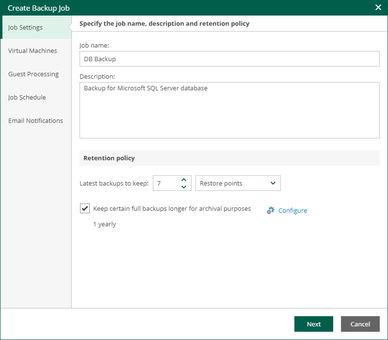

In this article

On the Jobs tab of Self-Service Backup Portal, you can perform the following operations with backup jobs:

* [Create a new backup job for vSphere VMs](#create)

* [Start, stop and retry jobs](starting_stopping_retrying_jobs.md)
* [Enable and disable jobs](enable_disable_job.md)
* [Edit backup job settings](#edit)

* [Delete backup jobs](#remove)

|  |
| --- |
| Important |
| * For the vSphere Self-Service Backup Portal tenants, job cloning is not available. * In vSphere Self-Service Backup Portal, you cannot create and edit jobs managed by backup servers of earlier major or minor versions. For example, after you upgrade Enterprise Manager to version 13.0, you will not be able to create and edit jobs managed by a backup server with version 12.3. To resolve the issue, upgrade the backup server as well. |

Creating Backup Job

To create a new vSphere backup job:

1. Open the Jobs tab of vSphere Self-Service Backup Portal and click Create.
2. At the Job Settings step of the wizard, specify the backup job name, description and retention policy settings. The retention policy defines how many restore points are kept in the backup repository and can be used for data restore.

For more information, see the [Retention Policy](https://helpcenter.veeam.com/docs/vbr/userguide/retention_policy.html?ver=13) section of the Veeam Backup & Replication User Guide.

1. At the Virtual Machines step of the wizard, select which vSphere VMs the job will process. For more information, see [Edit the List of Virtual Machines](jobs_edit_list_of_vms.md).
2. At the Guest Processing step of the wizard, select the guest OS processing options and guest OS credentials. For more information, see [Configure Guest Processing Settings](jobs_edit_guest_settings.md).
3. At the Job Schedule step of the wizard, configure the backup job scheduling options. For more information, see [Schedule the Job](jobs_edit_schedule.md).

You can configure backup job scheduling options only if the Enterprise Manager administrator allowed this in the properties of the tenant account. For more information, see [Adding Tenant Account](em_adding_tenant_accounts.md).

1. At the Email Notifications step of the wizard, select the Enable e-mail notifications check box and configure notification settings:

1. In the Recipients field, enter email addresses of recipients separated by comma.
2. [Optional] In the Subject field, specify the subject for notification emails.
3. Select Notify on success to receive an email notification when the job completes successfully.
4. Select Notify on warning to receive an email notification when the job completes with a warning.
5. Select Notify on error to receive an email notification when the job fails.
6. Select the Suppress notifications until the last retry check box to receive a notification about the final job status. If you do not enable this option, Veeam Backup & Replication will send one notification per every job retry.

1. Click Finish.

The backup job will create backups in the backup repository that the Enterprise Manager administrator selected as the target repository in the properties of the tenant account. Advanced job settings such as the backup settings and storage settings will be obtained from the job template assigned to the tenant by the administrator. For more information, see [Editing Tenant Account](em_editing_tenant_accounts.md).

Editing Backup Job

You can edit a backup at any time you need. For example, you may want to change scheduling settings for the job or add VMs to the job.

To edit backup job settings, do the following:

1. Open the Jobs tab of vSphere Self-Service Backup Portal.
2. In the working area, select the job you want to edit and click Edit.
3. In the Edit window, edit backup job settings as required. You will follow the same steps as you have followed when creating the job. For more information, see [Creating Backup Job](#create).

Removing Backup Job

You can permanently remove a backup job from the configuration database. Information about the deleted job will be removed from the Veeam Backup & Replication configuration database (and the Enterprise Manager database as well), and the job will no longer appear in the UI.

To remove a job, do the following:

1. Open the Jobs tab of vSphere Self-Service Backup Portal.
2. In the working area of the Jobs tab, select the job you want to delete.
3. Click Delete.
4. You will be prompted to delete backup files. To delete backup files, select the Delete backup files check box and click Yes to confirm the operation.

If four-eyes authorization is enabled on the backup server, backup files will remain in the backup repository and become orphaned.

Page updated 11/18/2025

Page content applies to build 13.0.1.1071
