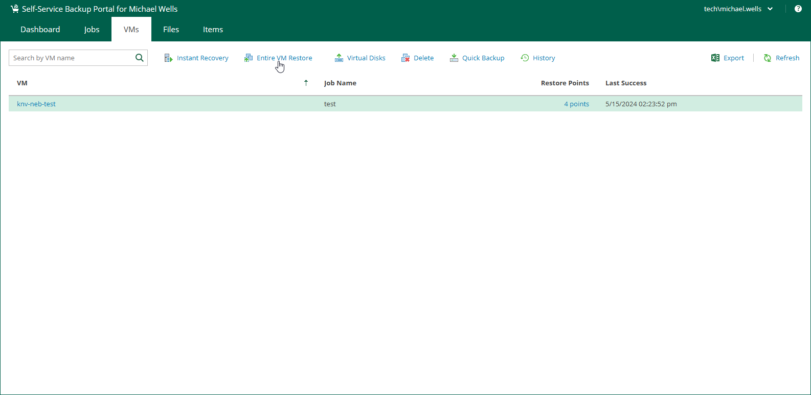
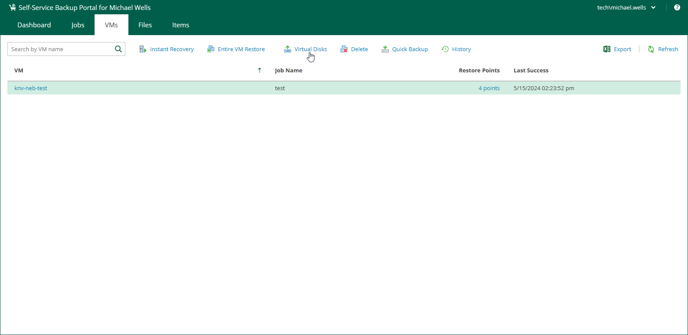

In this article

You can use vSphere Self-Service Backup Portal to perform the following operations with backed-up VMs:

* [Restore entire VM to VMware vSphere](#RestoringEntireVM)
* [Perform Instant Recovery to VMware vSphere](#PerformingInstantRecovery)
* [Restore VM disks](#disks)
* [Delete VMs](#delete)

Restoring Entire VM to VMware vSphere

You can restore and entire VM to the original location or a new location included in your restore scope.

|  |
| --- |
| Note |
| If your delegation mode is set to vSphere tags, the required tags must be assign to all VMware vSphere parent objects in the target location, including the host, VM folder, resource pool, datastore and network. For details on delegation modes, see [Configuring Delegation Mode](em_configuring_delegation_mode.md). |

To restore an entire VM:

1. On the VMs tab, select a VM that you want to restore. You can also use the search field to search for the necessary VM by its name.
2. Click Entire VM Restore.
3. Follow the steps of the Entire VM Restore wizard. For details, see [Restoring Entire VM to VMware vSphere](entire_vm_restore_vmware_perform.md).

Performing Instant Recovery to VMware vSphere

You can instantly recover a VMware vSphere VM to VMware vSphere. You can recover VMs from backups to the original location or a new location included in your restore scope. After you have performed Instant Recovery, you have to finalize it. For more information, see [Finalizing Instant Recovery to VMware vSphere](instant_recovery_vsphere_finalize.md).

To instantly recover a VM:

1. On the VMs tab, select a VM that you want to recover. You can also use the search field to search for the necessary VM by its name.
2. Click Instant Recovery.
3. Follow the steps of the Instant Recovery to VMware vSphere wizard. For details, see [Instant Recovery to VMware vSphere](instant_recovery_vsphere.md).

Restoring Virtual Disks

To restore individual virtual disks from backups of VMware vSphere VMs, do the following:

1. On the VMs tab, select a VM whose disks you want to restore. You can also use the search field to search for the necessary VM by its name.
2. Click Virtual Disks.
3. Follow the steps of the Virtual Disk Restore wizard. For details, see [Virtual Disk Restore](em_disk_restore.md).

Deleting VMs

You can delete a VM using vSphere Self-Service Backup Portal. This operation may be useful if you want to delete data of the backed-up VM from the backup repository. The deleted VM is not removed from the list of VMs immediately. The VM will be removed from the list after the VM records are removed from the configuration database of the backup server.

When you delete a VM, Enterprise Manager removes records about the VM from the UI and configuration database. In addition, Enterprise Manager removes data of the deleted VM from the backup.

|  |
| --- |
| Note |
| If four-eyes authorization is enabled on the backup server, you cannot delete a VM backup using either the portal or Enterprise Manager. |

To delete a VM, do the following:

1. On the VMs tab, select a VM. To quickly find the necessary VM, use the search field at the top of the window.
2. Click Delete.
3. Click Yes to confirm the deletion.

Page updated 11/18/2025

Page content applies to build 13.0.1.1071
