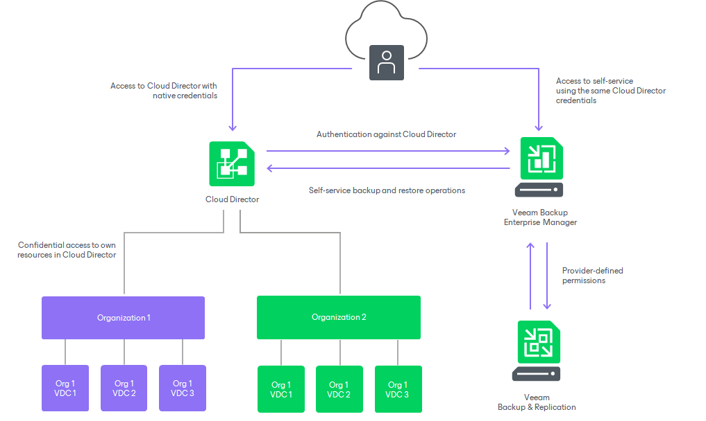

# Veeam Self-Service Backup Portal for Cloud Director

Veeam Backup Enterprise Manager allows you to perform the following operations with VMware Cloud Director objects:

* Back up VMs, vApps and other containers
* Restore VMs and vApps
* Restore VM guest OS files

Cloud Director service providers can allow their customers to perform self-service restore operations in the web UI based on Veeam Backup Enterprise Manager.

* Service provider administrators have administrative rights in Veeam Backup Enterprise Manager. Thus, they have access to the Configuration view of Enterprise Manager where they can create Cloud Director organization configurations, including repository quota and backup job template. These administrators typically have access to Veeam Backup & Replication console that controls VMware Cloud Director as part of backup infrastructure on the provider side.
* Members of Cloud Director organizations do not need administrative rights for Veeam Backup Enterprise Manager — instead, they get access to Veeam Self-Service Backup Portal. There they can manage their Cloud Director jobs, as well as restore VMs, files and application items within their scope.

How It Works

Veeam Backup Enterprise Manager uses native VMware Cloud Director authentication to authorize users that log in to Enterprise Manager. The authentication process and components interactions are shown in the figure below.

This approach helps to streamline administration and management tasks for service providers, as now they need to configure a tenant account only once in VMware Cloud Director, and then any change like a new password or a disable operation will be immediately reflected in Veeam Backup Enterprise Manager.

What Service Provider Administrators Can Do

Service provider administrators can perform the following operations when adding or editing organization configurations:

* Configure settings for their tenants (Cloud Director organizations), including backup job templates to be used, backup destination, and repository quota.
* Restrict job scheduling for particular tenants, for example, prevent the jobs from running too often. Administrators can even prohibit the tenant's ability to schedule jobs completely, instead setting the required schedule themselves (manually or using a script).

For more information, see [Adding Organization Configuration](em_configure_vcd_org.md).

These capabilities and the built-in load balancing allow administrators to ensure infrastructure is protected from excessive resource consumption.

What Members of Cloud Director Organizations Can Do

Members of Cloud Director organizations can use their Cloud Director credentials to access Veeam Self-Service Backup Portal. Once they log in, Enterprise Manager identifies the resources included in their scope — the entities the user is allowed to see and manage — and automatically filters Cloud Director objects when displaying them.

Members of Cloud Director organizations can perform the following operations:

* Create new backup jobs for objects in their scope, based on the predefined templates. Organization members are allowed to configure essential job settings (such as VMs to back up, retention, schedule, notifications, and guest OS processing options).
* Modify or delete jobs.
* Enable or disable jobs.
* Start, stop, retry jobs.
* View statistics on Cloud Director backups.
* Restore Cloud Director VMs to the original vApps and vApps to the original VDC.
* Perform application item restore for SQL Server and Oracle databases.
* Restore files from indexed and non-indexed VMs guest file system.

To simplify job management for tenants, advanced job parameters (like backup mode and repository settings) are automatically populated from the job templates. These templates are assigned by the service provider administrator to the particular organization.

In This Section

* [Managing Configurations for Cloud Director Organizations](em_managing_vcd_org.md)
* [Configuring Veeam Self-Service Backup Portal UI](configuring_vcd_portal.md)
* [Using Veeam Self-Service Backup Portal](vcd_portal.md)

