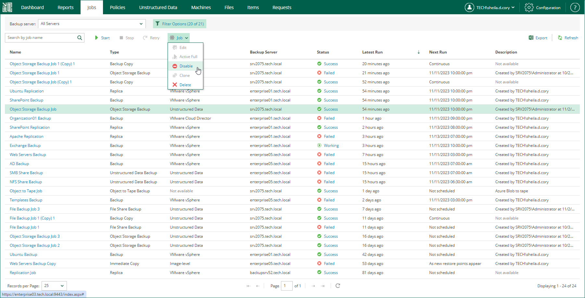

# Enabling and Disabling Jobs

Veeam Backup Enterprise Manager allows you to enable and disable jobs of the following types:

* Scheduled backup jobs

Disabled backup jobs do not start by the specified schedule. When you disable a job that backs up Microsoft SQL Server, Oracle or PostgreSQL machines, transaction log processing (if enabled for that job) will be also disabled.

* Scheduled replication jobs

Disabled replication jobs are not started by the specified schedule.

* Backup copy jobs

Disabled backup copy jobs do not monitor source backup repositories and do not copy restore points to the target backup repository.

To enable or disable a job:

1. On the Jobs tab, select a job from the list.
2. On the toolbar, click Job.
3. Select Enable or Disable from the list of commands.

