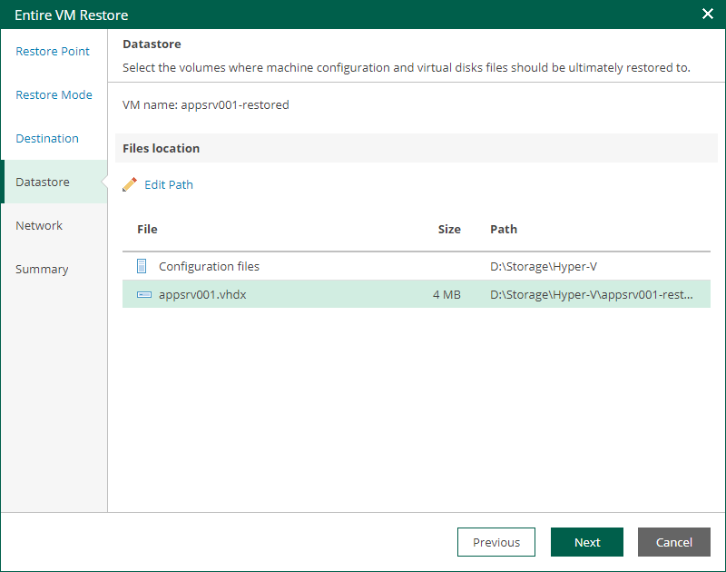

# Step 5. Specify Datastore

The Datastore step of the wizard is available if you restore a VM to a new location or with different settings.

At this step of the wizard, you can change default paths where VM configuration files and disk files will be stored.

To change a default path, do the following:

1. Select the configuration files or one of the disk files and click Edit Path.

Alternatively, you can double-click a file to edit its path.

1. Type in a path to the folder where the files will be stored. You can specify an existing folder, a new folder or an SMB3 shared folder. SMB3 shared folder path must be in the UNC format, for example: \\172.16.11.38\Share01.
2. Click OK.

|  |
| --- |
| Important |
| The host or cluster on which you register VMs must have access to the specified SMB3 shared folder. If you are using SCVMM 2012 or later, the server hosting the Microsoft SMB3 shared folder must be registered in SCVMM as a storage device. For more information, see [Microsoft Docs](https://docs.microsoft.com/en-us/previous-versions/system-center/system-center-2012-R2/jj614620%28v%3Dsc.12%29). |

