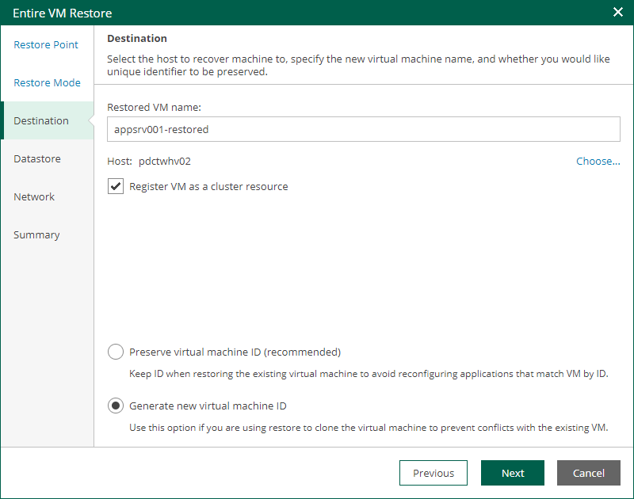

# Step 4. Specify Destination Settings

The Destination step of the wizard is available if you restore a VM to a new location or with different settings.

At this step of the wizard, you can specify a name of the restored VM and target host, register the VM as a cluster resource, and generate a new BIOS UUID.

To configure destination settings, do the following:

1. In the Restored VM name field, specify a name under which the workload will be restored.
2. In the Host field, specify a target host.
3. If the specified host is a part of a Hyper-V failover cluster, you can register the restored VM as a cluster resource. In this case, if the target host is brought offline or fails for any reason, the VM will fail over to another node in the cluster. To do this, select the Register VM as a cluster resource check box.
4. Choose whether to preserve the BIOS UUID or generate a new BIOS UUID.

If the original VM still resides in the production environment, select the Generate new BIOS UUID option to prevent conflicts. The BIOS UUID change is not required if the original VM no longer exists, for example, if it was deleted.

