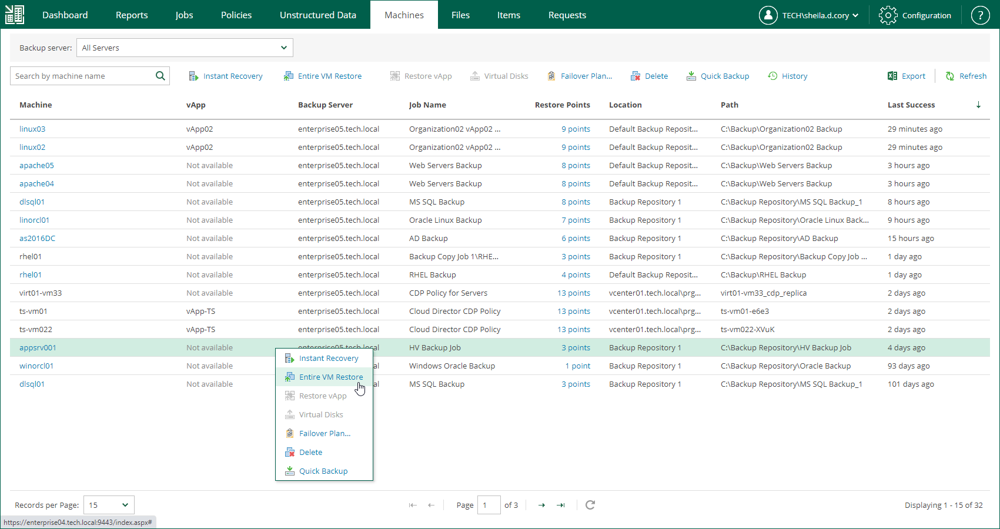

In this article

To launch the Entire VM Restore wizard, do the following:

1. Open the Machines tab and select the necessary Microsoft Hyper-V VM from the list.
2. On the toolbar, click Restore.

Alternatively, you can right-click the VM and select Entire VM Restore.

Page updated 9/2/2025

Page content applies to build 13.0.1.1071
