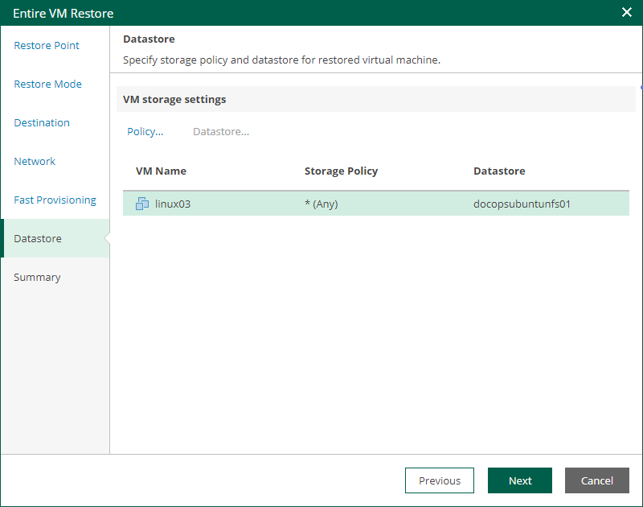

# Step 7. Specify Storage Policy and Datastore

The Datastore step of the wizard is available if you restore a VM to a new location or with different settings.

At this step of the wizard, you can specify a storage policy and datastore for the restored VM.

1. To change the target storage policy, do the following:

1. Select a VM and click Policy.
2. In the Select Storage Policy window, select a storage policy and click OK.

1. To change the target datastore, do the following:

1. Select a VM and click Datastore.
2. In the Select Datastore window, select a datastore and click OK.

