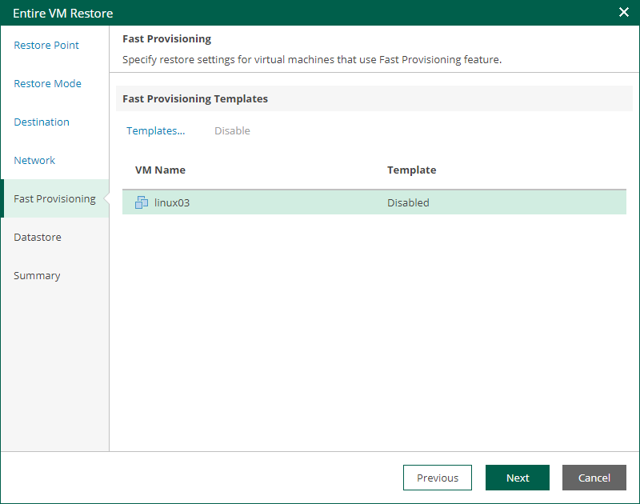

In this article

The Fast Provisioning step of the wizard is available if you restore a VM to a new location or with different settings, and if fast provisioning is enabled on the target organization VDC.

At this step of the wizard, you can configure fast provisioning for the restored VM.

* To specify a fast provisioning template for the VM, select the VM in the list, click Templates, and choose a template to which the restored VM must be linked.
* To disable fast provisioning for the VM and restore it as a regular VM, select the VM in the list and click Disable.

Page updated 9/4/2025

Page content applies to build 13.0.1.1071
