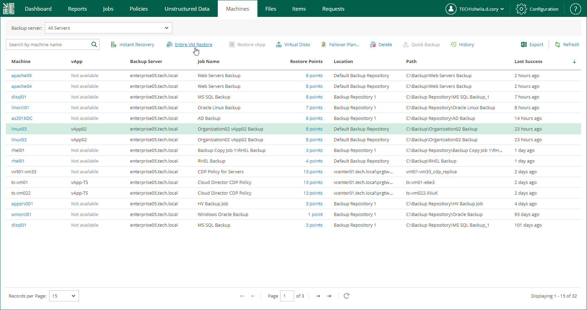

# Step 1. Launch Entire VM Restore Wizard

To launch the Entire VM Restore wizard, do the following:

1. Open the Machines tab and select the necessary VMware Cloud Director VM from the list.
2. On the toolbar, click Entire VM Restore.

Alternatively, you can right-click the VM and select Entire VM Restore.

