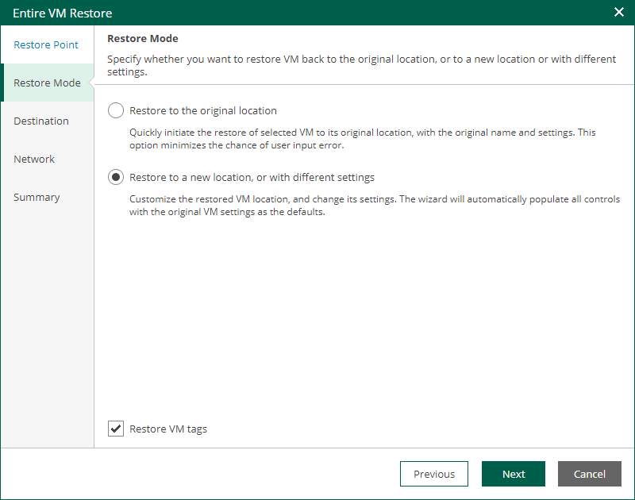

In this article

At the Restore mode step, specify a destination for VM recovery and select whether you want to recover VM tags.

When you perform entire VM restore using Veeam Backup Enterprise Manager, Veeam Backup & Replication automatically selects a backup proxy over which VM data must be transported to the source datastore. You can select a backup proxy manually from the Entire VM Restore wizard in the Veeam Backup & Replication console. For more information, see the [Select Restore Mode](https://helpcenter.veeam.com/docs/vbr/userguide/vcloud_director_full_vm_restore_mode.html?ver=13) section of the Veeam Backup & Replication User Guide.

1. Select a restore mode:

* Restore to the original location — select this option to restore the VM with initial settings and to the original location. If this option is selected, you will pass directly to the [Summary](entire_vm_restore_vcd_summary.md) step of the wizard.

During restore to the original location, Veeam Backup & Replication restores only those disks that are included in the backup file. This means that after the restore finishes, you do not have to update existing jobs which process the original VMs.

* Restore to a new location or with different settings — select this option to restore the VM to a new location, or to any location but with different settings. If this option is selected, the Entire VM Restore wizard will include additional steps for customizing VM settings.

During restore to a new location, Veeam Backup & Replication creates new VMs. If you want to process the restored VMs, you must edit existing jobs or create new jobs to process the restored VMs. If you restore VMs with the same name and to the same folder as the original VMs, Veeam Backup & Replication deletes the original VMs. In this case, you must edit existing jobs to exclude original VMs from them.

1. If you want to restore tags that were assigned to the original VM and assign them to the recovered VM, select the Restore VM tags check box. Veeam Backup & Replication will restore the VM with original tags if the following conditions are met:

* You restore a VM to the original location.
* The original VM tags are available on the source vCenter Server.

Page updated 9/4/2025

Page content applies to build 13.0.1.1071
