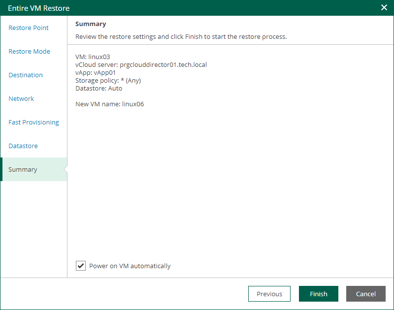

In this article

At the Summary step of the wizard, check restore settings and click Finish. If you want to start the restored VM on the target host, select the Power on target VM after restoring check box.

To view the restore progress, on the Machines tab, click History.

Page updated 9/4/2025

Page content applies to build 13.0.1.1071
