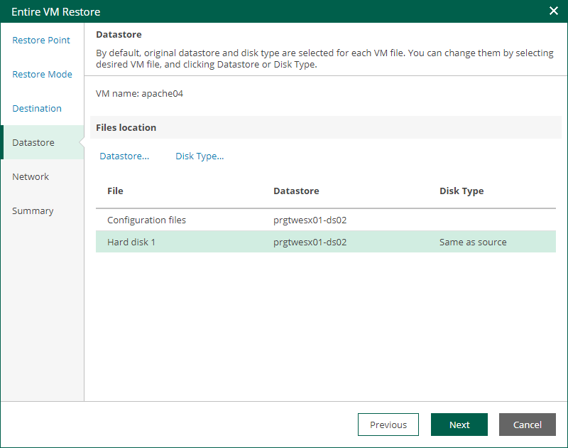

In this article

The Datastore step of the wizard is available if you restore a VM to a new location or with different settings.

At this step of the wizard, you can specify target datastore for VM configuration files and VM disk files, as well as change the disk type (provisioning policy) for the recovered VM. By default, Veeam Backup & Replication uses the datastore and disk type settings of the original VM. You can place an entire VM to a particular datastore or choose to store configuration files and disk files of the restored VM in different locations.

To specify a datastore and disk type, take the following steps:

1. To change the target datastore for VM configuration files or disk files, do the following:

1. Select the configuration files or one of the hard disks and click Datastore.
2. In the Select Datastore window, choose the necessary datastore and click OK.

1. By default, hard disks of the restored VM have the same type as disks of the original VM. To change the disk type, do the following:

1. Select a hard disk and click Disk Type.
2. In the Restored VM Disk Type window, select a disk format and click OK. For more information about disk formats, see the [Virtual Disk Options](https://techdocs.broadcom.com/us/en/vmware-cis/vsphere/vsphere/8-0/vsphere-storage-8-0/using-vmkfstools-in-vsphere/virtual-disk-options-of-vsphere-vmkfstools-command.html) section of the VMware vSphere documentation.

|  |
| --- |
| Note |
| You can only change disk format for VMs with Virtual Hardware version 7 or later. |

Page updated 9/4/2025

Page content applies to build 13.0.1.1071
