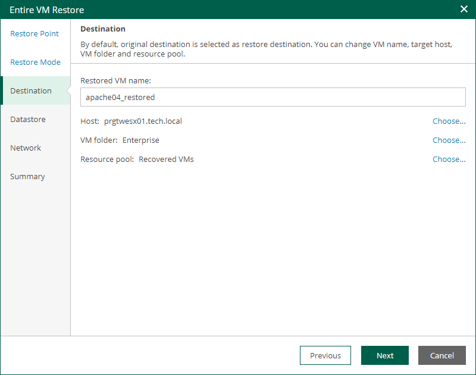

In this article

The Destination step of the wizard is available if you restore a VM to a new location or with different settings.

At this step of the wizard, you configure destination settings such as a name of the restored VM, target host, VM folder and resource pool.

1. In the Restored VM name field, specify a name under which the workload will be restored.
2. In the Host field, specify a host on which the VM will run.
3. In the VM folder field, specify a folder to which the recovered VM files will be placed.
4. In the Resource pool field, specify a resource pool to which the VM will be placed.

Page updated 9/4/2025

Page content applies to build 13.0.1.1071
