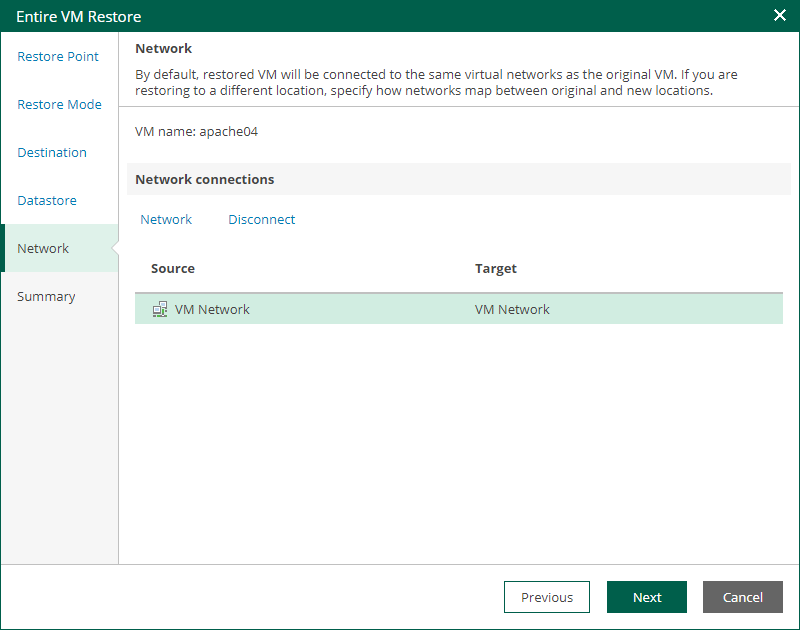

# Step 6. Configure Network Mapping

The Network step of the wizard is available if you restore a VM to a new location or with different settings.

At this step of the wizard, you can map a network in the original site to the network in the target site. During the restore process, Veeam Backup & Replication will update VM configuration files to replace the original networks with the specified networks in the target site. As a result, you will not have to re-configure network settings manually.

To change networks to which the restored VM will be connected:

1. From the Network connections list, select the necessary network.
2. Configure VM network mapping:

* To connect the restored VM to another network, do the following:

1. Click Network.
2. In the Select Network window, select a necessary network and click OK.

* To disconnect the recovered VM from the network, click Disconnect.

