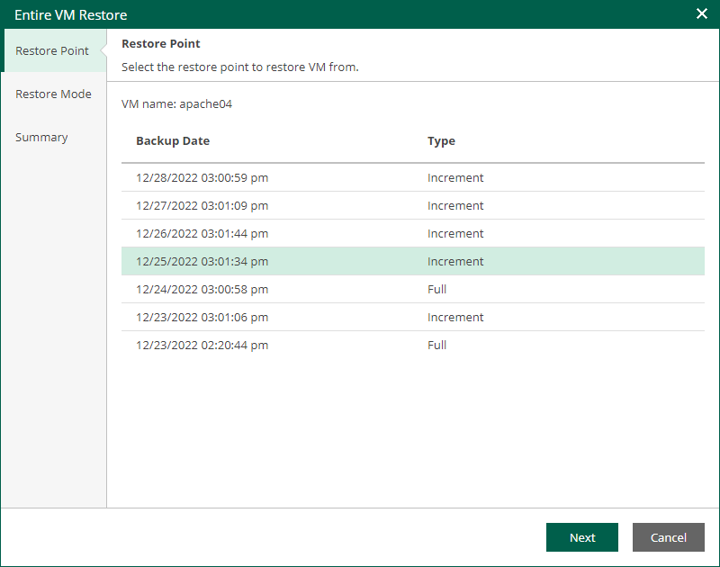

In this article

At the Restore Points step of the wizard, select a VM restore point for which you want to perform entire VM restore.

Page updated 9/4/2025

Page content applies to build 13.0.1.1071
