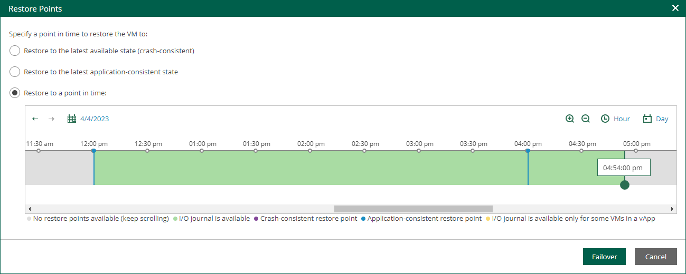

In this article

If a VM is processed by a CDP policy, you can fail over the VM to its replica. After the failover operation completes, the VM replica is powered on.

Failover is an intermediate step that you must finalize in the Veeam Backup & Replication console. In the console, you can undo failover, perform permanent failover or perform failback. For more information, see the [Replica Failover and Failback](https://helpcenter.veeam.com/docs/vbr/userguide/failover_failback.html?ver=13) section of the Veeam Backup & Replication User Guide.

To perform failover:

1. On the Machines tab, select a machine processed by a CDP policy.
2. Click Entire VM Restore.
3. In the Restore window, select the restore point you need. You can fail over to the latest available crash-consistent state, to the latest application-consistent state or to a specific point in time.

|  |
| --- |
| Tip |
| * To quickly find a long-term restore point, use the calendar. * To zoom in or zoom out the time line, use the Plus and Minus buttons or switch between the Hour and Day views. |

1. Click Failover.

To view the failover progress, on the Machines tab, click History.

Page updated 9/4/2025

Page content applies to build 13.0.1.1071
