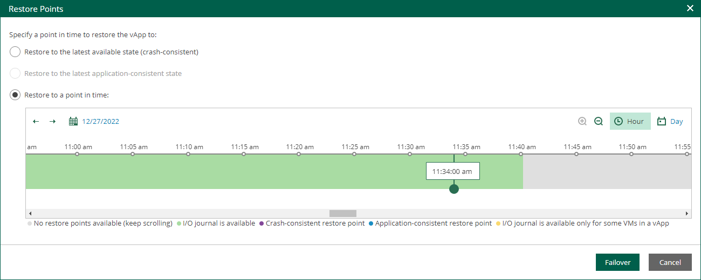

# Failover to Cloud Director CDP Replica

If a VM is processed by a VMware Cloud Director CDP policy, you can perform failover of the vApp that contains the VM.

Failover is an intermediate step that you must finalize in the Veeam Backup & Replication console. In the console, you can undo failover, perform permanent failover or perform failback. For more information, see the [Replica Failover and Failback](https://helpcenter.veeam.com/docs/vbr/userguide/failover_failback.html?ver=13) section of the Veeam Backup & Replication User Guide.

To perform failover, do the following:

1. On the Machines tab, select a machine processed by a Cloud Director CDP policy.
2. Click Restore vApp.
3. In the Restore Points window, select the restore point you need. You can fail over to the latest available crash-consistent state, to the latest application-consistent state, or to a specific point in time.

Application consistency is defined for the whole vApp. A vApp restore point is application-consistent if all VMs have application-consistent restore points. A vApp restore point is mixed if some VMs have crush-consistent restore points.

|  |
| --- |
| Tip |
| * To quickly find a long-term restore point, use the calendar. * To zoom in or zoom out the time line, use the Plus and Minus buttons or switch between the Hour and Day views. |

1. Click Failover.

To view the failover progress, on the Machines tab, click History.

