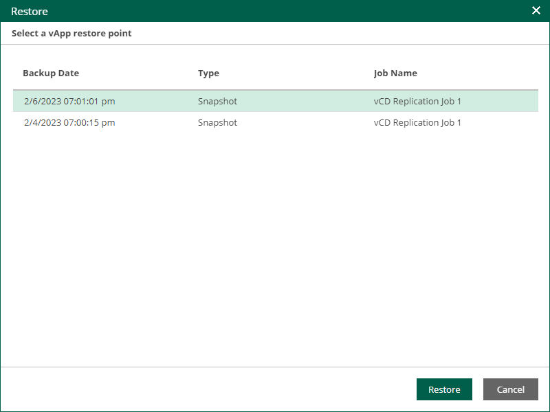

In this article

If a VM is processed by a VMware Cloud Director replication job, you can perform failover of the vApp that contains the VM.

Failover is an intermediate step that you must finalize in the Veeam Backup & Replication console. In the console, you can undo failover, perform permanent failover or perform failback. For more information, see the [Replica Failover and Failback](https://helpcenter.veeam.com/docs/vbr/userguide/failover_failback.html?ver=13) section of the Veeam Backup & Replication User Guide.

To perform failover, take the following steps:

1. On the Machines tab, select a machine processed by a Cloud Director replication job.
2. Click Failover Now.
3. In the Restore window, select a restore point of the vApp.
4. Click Restore.
5. To confirm failover, click Yes.

To view the failover progress, on the Machines tab, click History.

Page updated 1/15/2026

Page content applies to build 13.0.1.1071
