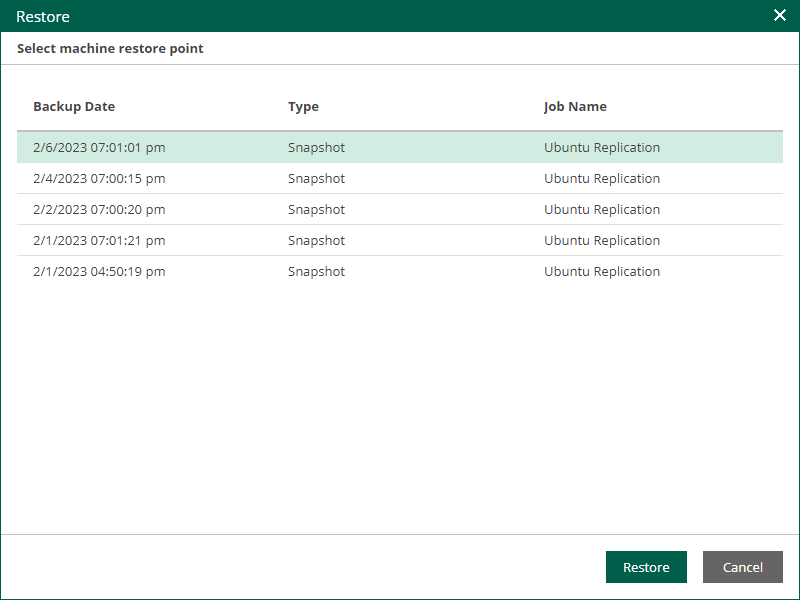

In this article

If a VM is processed by a regular replication job, you can fail over the VM to its replica. After the failover operation completes, the VM replica is powered on.

Failover is an intermediate step that you must finalize in the Veeam Backup & Replication console. In the console, you can undo failover, perform permanent failover or perform failback. For more information, see the [Replica Failover and Failback](https://helpcenter.veeam.com/docs/vbr/userguide/failover_failback.html?ver=13) section of the Veeam Backup & Replication User Guide.

To perform failover:

1. On the Machines tab, select a machine processed by a replication job.

1. Click Entire VM Restore.
2. In the Restore window, select a restore point of the VM.
3. Click Restore.
4. To confirm failover, click Yes.

To view the failover progress, on the Machines tab, click History.

Page updated 9/4/2025

Page content applies to build 13.0.1.1071
