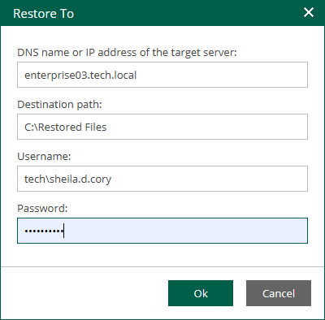

In this article

Enterprise Manager enables you to restore specific files from backup of a Microsoft Windows VM to another Microsoft Windows VM. You can also use this option to restore files to to the same VM but a different location.

To restores files to another location, do the following:

1. Find the objects you want to restore. You can select one or multiple objects. For details, see [Browsing Machine Backups for Guest OS Files](browsing_vm_backups.md) and [Searching for Guest OS Files in Machine Backups](searching_vm_backups.md).
2. Click Restore to and choose one of the following options:

* Select Overwrite, to replace an object with the same name on the target machine with the object from the backup.
* Select Keep, to restore the object from the backup next to the object on the target machine. The restored object will have the \_RESTORED\_<DATE>\_<TIME> prefix in its name, where <DATE>\_<TIME> is the restore date and time.

1. In the displayed window, click Yes to proceed.
2. In the Restore To window, specify restore location and credentials for connection to the target machine.

For Microsoft Windows machines, specify the following settings:

1. In the DNS name or IP address of the target server field, specify a DNS name, IPv4 or IPv6 address of a Microsoft Windows machine.
2. In the Destination path field, specify a path to the folder on the target machine where the files must be restored. If the destination folder does not exist, it will be created.
3. In the Username and Password fields, specify credentials required for connection to the target machine.
4. To start restoring files, click OK.

For Linux machines, specify the following settings:

1. In the DNS name or IP address of the target server field, specify a DNS name, IPv4 or IPv6 address of a Linux machine.
2. In the Destination path field, specify a path to the folder on the target machine where the files must be restored. If the destination folder does not exist, it will be created.
3. In the Username and Password fields, specify credentials required to connect to the target machine.

If you specify a non-root account that does not have root privileges on the Linux machine, you can grant this account elevated permissions as follows:

1. To provide a non-root user with root account privileges, select the Elevate specified account to root check box.
2. To add the user account to the sudoers file, select the Add account to the sudoers file automatically check box. In the Root password field, enter the root account password.

If you do not enable this option, you will have to manually add the user account to the sudoers file.

1. If you plan to use the account to connect to Linux servers where the sudo command is not available or may fail, you have an option to use the su command instead. To enable the su command, select the Use "su" if "sudo" fails check box and in the Root password field, enter the root account password.

Veeam Backup & Replication will first try to use the sudo command. If the attempt fails, Veeam Backup & Replication will use the su command.

Alternatively, you can use a Linux private key. Ensure that the public key is stored on the target machine in the authorized\_keys file. In this case, specify the private key and private key passphrase.

1. To start restoring files, click OK.

1. Check the restore process and results in the File Restore History view.

Page updated 11/10/2025

Page content applies to build 13.0.1.1071
