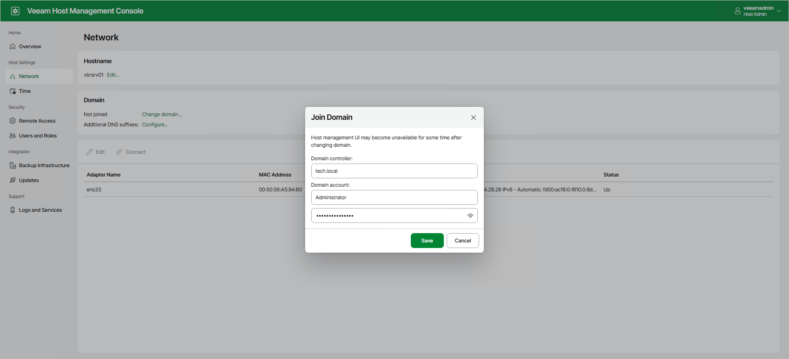

In this article

In the Veeam Host Management web UI, you can change domain membership of the server. To do this, perform the following steps:

1. Log in to the Veeam Host Management web UI as a Host Administrator.
2. In the management pane, click Network.
3. In the Domain section, select one of the following options:

* If the server is not a part of a domain, click Change domain. In the Join Domain window, specify the domain name and credentials with domain joining permissions. Then, click Save.

|  |
| --- |
| Note |
| It is recommended to specify the domain name instead of the FQDN of a specific domain controller. This can mitigate domain joining issues if this domain controller is unavailable for some reason. |

* If the server is a part of a domain, click Leave domain and confirm the operation.

After you change the domain membership, all services running on the server will be restarted.

To specify additional DNS suffixes, click Configure next to the setting name.

Page updated 11/20/2025

Page content applies to build 13.0.1.1071
