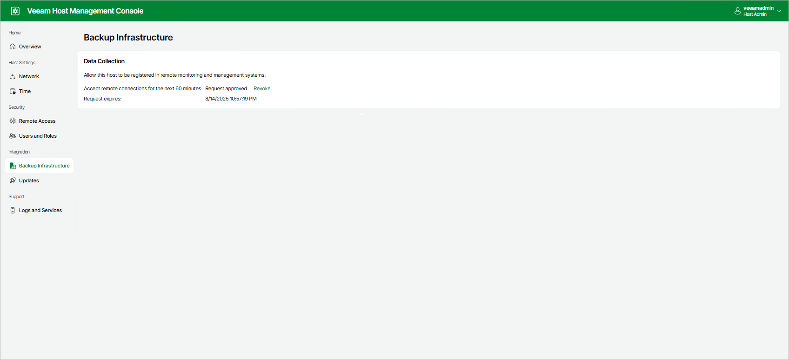

In this article

By default, other Veeam monitoring and data management solutions including Veeam ONE, Veeam Recovery Orchestrator and Veeam Service Provider Console cannot install their agents on Veeam Software Appliance. To allow this operation, perform the following steps:

1. Log in to the Veeam Host Management web UI as a Host Administrator.
2. In the management pane, click Backup Infrastructure.
3. In the Data Collection section, click Submit Request:

* If you did not configure the Security Officer account during the Veeam Software Appliance installation, remote connections for Veeam Agents will be allowed immediately for 60 minutes.
* If you configured the Security Officer account, remote connections for Veeam Agents will be allowed for 60 minutes after the Security Officer approves the request.

If required, you can revoke permission before expiration. To do this, click Revoke.

Page updated 12/16/2025

Page content applies to build 13.0.1.1071
