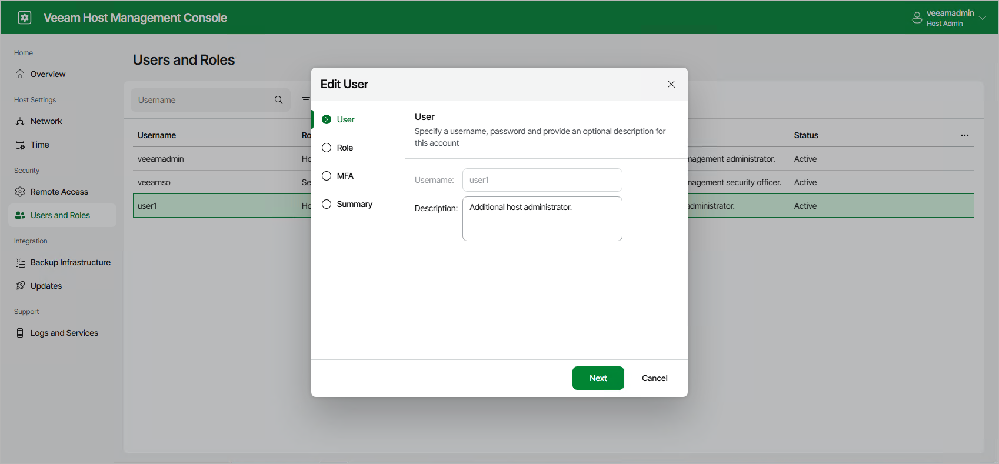

In this article

Users with Host Administrator permissions can perform the following operations related to configuring local Veeam Software Appliance users:

* Create, edit, and remove user accounts
* Assign roles
* Enable and disable multi-factor authentication

Users with Security Officer permissions cannot configure local users.

User Roles

The following table describes roles you can assign to the local users.

| Role | Description |
| --- | --- |
| Host Administrator | Can perform all administrative activities in the Veeam Host Management web UI and TUI:   * Configure network settings * Configure server time settings * Configure remote access settings * Manage users and roles * Configure backup infrastructure integrations * Manage software updates * Perform maintenance tasks   The default Host Administrator account is veeamadmin. |
| Security Officer | Can perform the following operations in the Veeam Host Management web UI:   * Reset user passwords * Reset user multi-factor authentication * Manage authorization requests * Manage password recovery tokens  * Manage configuration backups * Export events   Security Officer does not have access to the Veeam Host Management TUI.  The default Security Officer account is veeamso. |
| User | Manages backup and restore operations in accordance with the assigned backup server role. Use this role to create backup console users when the Veeam Software Appliance is not joined to a domain.  User must reset their password at first sign-in.  Has limited permissions to the system and no access to the Veeam Host Management console. |
| Service Account | Provides credentials for standalone backup agents and plug-ins to authenticate with the backup server.  Service Account cannot be used for interactive logons to management consoles and does not require password rotation.  Has limited permissions to the system and no access to the Veeam Host Management console. |

Creating Users

To create a new user, perform the following steps:

1. Log in to the Veeam Host Management web UI as a Host Administrator.
2. In the management pane, click Users and Roles.
3. Click Add.
4. At the User step of the wizard, specify the name of the user, a password, and a description.

|  |
| --- |
| Note |
| Consider the following:   * The password must meet the following requirements:  + 15 characters minimum. + 1 upper case character. + 1 lower case character. + 1 numeric character. + 1 special character. + No more than 3 characters of the same class in a row. For example, more than 3 lowercase or 3 numerical characters in sequence.  * Passwords stay valid for 60 days. When a password expires, a user will need to specify a new one that follows requirements. * After you add the user, you cannot change its name. |

1. Click Next.
2. At the Role step of the wizard, select the role and click Next. You can assign only one role to the user.
3. At the MFA step of the wizard, enable or disable multi-factor authentication for the user and click Next.

|  |
| --- |
| Note |
| Consider the following:   * If you add a user with the Security Officer role, you cannot disable MFA. * If you add a user with the User or Service Account role, this step will be skipped. |

1. At the Summary step of the wizard, review the data and click Finish.

Editing Users

To edit a user, perform the following steps:

1. Log in to the Veeam Host Management web UI as a Host Administrator.
2. In the management pane, click Users and Roles.
3. Click Edit.
4. Change the description and the role if necessary. For Host Administrator accounts, you can also enable or disable multi-factor authentication.
5. Review the data and click Finish.

Removing Users

To remove a user, perform the following steps:

1. Log in to the Veeam Host Management web UI as a Host Administrator.
2. In the management pane, click Users and Roles.
3. Select the user, click Remove and confirm the operation.

|  |
| --- |
| Note |
| You cannot remove the default veeamadmin and veeamso user accounts. |

Enabling Multi-Factor Authentication

To enable multi-factor authentication for Host Administrator accounts, perform the following steps:

1. Log in to the Veeam Host Management web UI as a Host Administrator.
2. In the management pane, click Users and Roles.
3. Select the user.
4. Click Settings > Enable MFA.

For Security Officer accounts, multi-factor authentication is always enabled.

Disabling Multi-Factor Authentication

To disable multi-factor authentication for Host Administrator accounts, perform the following steps:

1. Log in to the Veeam Host Management web UI as a Host Administrator.
2. In the management pane, click Users and Roles.
3. Select the user.
4. Click Settings > Disable MFA.

For Security Officer accounts, multi-factor authentication cannot be disabled.

Page updated 1/14/2026

Page content applies to build 13.0.1.1071
