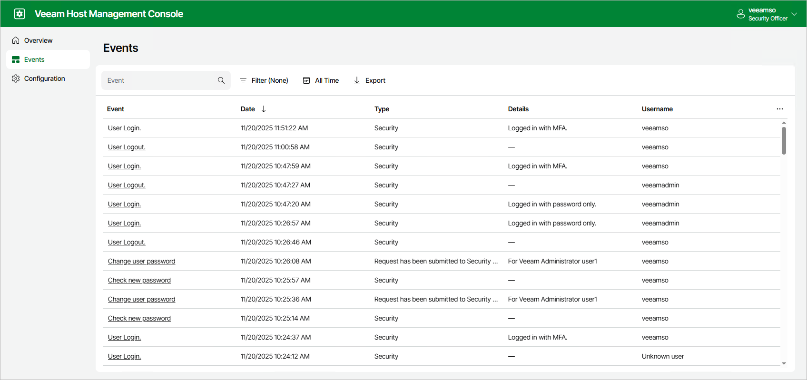

# Performing Security Officer Tasks

Users with Security Officer permissions can perform the following tasks in the Veeam Host Management web UI:

* Approve or decline authorization requests
* View authorization request events
* Reset own password
* Reset MFA
* Reset password recovery token
* Use password recovery token to resolve authentication issues
* View and export Veeam Software Appliance eventsManaging Authorization Requests

  You can approve or decline the following requests from Host Administrators:

  + Enable SSH
  + Stop a Veeam service
  + Grant temporary root access
  + Reset password for the locked user
  + Import configuration files
  + Change a domain membership
  + Add a Security Officer account
  + Allow remote connections for Veeam AgentsTo manage authorization requests, perform the following steps:
    1. Log in to the Veeam Host Management web UI as a Security Officer
    2. In the management pane, click Overview.
    3. Select the request and click Approve or Decline.

    

    Viewing Authorization Request Events

    Events related to Security Officer authorization requests include information about:

    - Approved and rejected requests
    - Locked and unlocked Host Administrator accounts

    As a Security Officer, you can view these events in the Veeam Host Management web UI. For more information, see [Viewing Appliance Events](#view_appliance_events).

    Resetting Own Password

    As a Security Officer, you can reset your password in the Veeam Host Management web UI. To do this, perform the following steps:

    1. Log in to the Veeam Host Management web UI as a Security Officer.
    2. In the management pane, click Overview.
    3. Click Change password.
    4. Specify the current password and a new password and click Apply.

    |  |
    | --- |
    | Note |
    | If you forgot or lost the password, or your Security Officer account locked after three failed login attempts, you can use a recovery token to restore access to your account. For more information, see [Using Recovery Token](#use_recovery_token). |

    

    Resetting MFA

    If you have multi-factor authentication issues, lose or change a mobile device with the mobile authentication application, you can use a recovery token to restore access to your account. For more information, see [Using Recovery Token](#use_recovery_token).

    Resetting Password Recovery Token

    You can reset your current password recovery token. To do this, perform the following steps:

    1. Log in to the Veeam Host Management web UI as a Security Officer.
    2. In the management pane, click Overview.
    3. Click Create password recovery token and confirm the operation.
    4. Enter a 6-digit confirmation code generated in the mobile authenticator application.
    5. Copy new recovery token and save it in a secure place.

    |  |
    | --- |
    | Note |
    | A new recovery token is also generated when you use your current recovery token to solve authentication issues. For more information, see [Using Recovery Token](#use_recovery_token). |

    

    Using Recovery Token

    If you forgot or lost the password, your Security Officer account locked after three failed login attempts, or you have multi-factor authentication issues, you can restore access through the recovery token generated during the initial Security Officer logon. To do this, perform the following steps:

    1. In the Veeam Host Management web UI sign-in page, click Forgot password?.
    2. Click I have a password recovery token.
    3. Specify your recovery token and click Sign in.
    4. Complete the Security Officer Initialization wizard to enter new password, set up multi-factor authentication and get new recovery token.
    5. Click Finish.

    

    Viewing Appliance Events

    You can monitor system, security, configuration and other types of events occurred on the Veeam Software Appliance. To view the list of events, log in to the Veeam Host Management web UI as a Security Officer and click Events in the management pane.

    To export all events in the CSV format, click Export.

    

