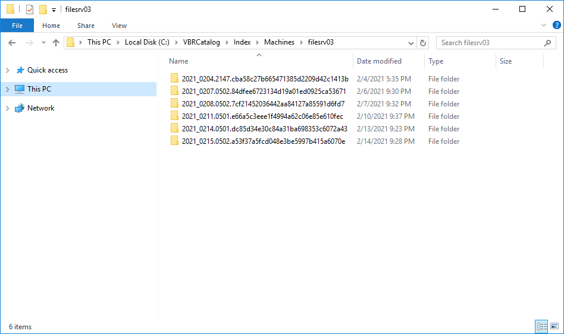

# Indexing Data

Veeam Backup & Replication stores indexing data in the Veeam Backup Catalog folder. By default, the Veeam Backup Catalog is located in the C:\VBRCatalog folder on the Veeam backup server and on Veeam Backup Enterprise Manager.

Veeam Backup Catalog comprises the following data:

* [Machine index](#machine_index)
* [Session index](#session_index)

Machine Index

Machine index reproduces the structure of files and folders on the machine guest OS. Veeam Backup & Replication uses the file index to search for guest OS files within machine backups.

For every machine whose file system has been indexed, there is a dedicated folder that contains indexing data for all restore points available for the machine.

Session Index

Veeam Backup Catalog keeps information for every backup job session. Session indexing data describes which machine restore points correspond with a specific backup job session and what sets of files are required to restore a machine to a specific point in time.

Session indexing files vary for incremental and reverse incremental backup chains:

* For incremental backup chains, a session indexing file contains information about only one restore point — the restore point that is created with this backup job session. Additionally, it contains information about a set of files that is required to restore a machine to this point in time. For example, if a backup chain contains 5 restore points, the 5th session indexing file will contain information about the 5th restore point and a group of 5 files that are required to restore the machine to this point in time.

|  |
| --- |
| BackupServer=BACKUP01  JobName=srv04  SessionDateUtc=05/13/2014 08:05:57.081  ####################################################  #  OIBS  oib0.VmName=srv04  oib0.BackupTimeUtc=05/13/2025 08:02:04.988  oib0.OibUID=f81f790c-103e-4351-81a4-e4ec8a8c290c  oib0.Platform=EVmware  oib0.Group=grp0  ####################################################  #  BACKUP FILE GROUPS  grp0.file0.Server=BACKUP01  grp0.file0.Path=c:\backup\srv04\srv042025-05-13T010101.vib  grp0.file0.ModifyDateUtc=05/13/2025 08:04:10.293  grp0.file1.Server=BACKUP01  grp0.file1.Path=c:\backup\srv04\srv042025-05-13T004536.vib  grp0.file1.ModifyDateUtc=05/13/2025 07:47:52.077  grp0.file2.Server=BACKUP01  grp0.file2.Path=c:\backup\srv04\srv042025-05-13T000053.vib  grp0.file2.ModifyDateUtc=05/13/2025 07:04:24.38  grp0.file3.Server=BACKUP01  grp0.file3.Path=c:\backup\srv04\srv042025-05-12T230102.vib  grp0.file3.ModifyDateUtc=05/13/2025 06:04:25.003  grp0.file4.Server=BACKUP01  grp0.file4.Path=c:\backup\srv04\srv042025-05-12T220051.vib  grp0.file4.ModifyDateUtc=05/13/2025 05:03:53.817  grp0.file5.Server=BACKUP01  grp0.file5.Path=c:\backup\srv04\srv042025-05-12T210105.vbk  grp0.file5.ModifyDateUtc=05/13/2025 04:07:55.047 |

* For reverse incremental backup chains, a session indexing file contains information about all restore points engaged in the backup job session. In a reverse incremental chain, the last restore point is always a full backup. To produce a full backup and calculate incremental changes, Veeam Backup & Replication needs to address all points in the job. For this reason, the session indexing file refers not only to the restore point created with the backup job session, but also to all restore points preceding it. Additionally, a session indexing file describes groups of files that are required to restore a machine to all possible restore points. For every restore point, there is a separate group of files.

For example, if you have a reverse incremental chain of 3 restore points, the session indexing file for the last backup job session will contain information about 3 restore points and will describe three groups of files:

* Group 0 will list restore points that are required to restore the machine to the 1st, the earliest restore point.
* Group 1 will list restore points that are required to restore the machine to the 2nd restore point.
* Group 2 will list restore points that are required to restore the machine to the 3rd, the latest restore point.

|  |
| --- |
| BackupServer=SRV02  JobName=srv01\_reversed  SessionDateUtc=05/14/2025 11:20:18.952  ####################################################  #  OIBS  oib0.VmName=srv01  oib0.BackupTimeUtc=05/14/2025 10:56:55.993  oib0.OibUID=47c62e82-3066-478c-8272-1fb65a47d601  oib0.Platform=EVmware  oib0.Group=grp1  oib1.VmName=srv01  oib1.BackupTimeUtc=05/14/2025 11:02:20.15  oib1.OibUID=d39f4a3c-2b5b-415a-ae0d-e9acc49f63a0  oib1.Platform=EVmware  oib1.Group=grp2  oib2.VmName=srv01  oib2.BackupTimeUtc=05/14/2025 11:16:52.779  oib2.OibUID=1f3c31bf-9541-46ac-9826-62ecfd76a291  oib2.Platform=EVmware  oib2.Group=grp3  ####################################################  #  BACKUP FILE GROUPS  grp0.file0.Server=BACKUP  grp0.file0.Path=c:\backup\srv01\_reversed\srv01\_reversed2025-05-14T035606.vrb  grp0.file0.ModifyDateUtc=05/14/2025 10:56:55.993  grp0.file1.Server=BACKUP  grp0.file1.Path=c:\backup\srv01\_reversed\srv01\_reversed2025-05-14T040137.vrb  grp0.file1.ModifyDateUtc=05/14/2025 11:18:14.43  grp0.file2.Server=BACKUP  grp0.file2.Path=c:\backup\srv01\_reversed\srv01\_reversed2025-05-14T041612.vbk  grp0.file2.ModifyDateUtc=05/14/2025 11:18:45.973  grp1.file0.Server=BACKUP  grp1.file0.Path=c:\backup\srv01\_reversed\srv01\_reversed2025-05-14T040137.vrb  grp1.file0.ModifyDateUtc=05/14/2025 11:18:14.43  grp1.file1.Server=BACKUP  grp1.file1.Path=c:\backup\srv01\_reversed\srv01\_reversed2025-05-14T041612.vbk  grp1.file1.ModifyDateUtc=05/14/2025 11:18:45.973  grp2.file0.Server=BACKUP  grp2.file0.Path=c:\backup\srv01\_reversed\srv01\_reversed2025-05-14T041612.vbk  grp2.file0.ModifyDateUtc=05/14/2025 11:18:45.973  BSessionVersion=5 |

A full backup file “moves forward” with every new backup job run, and Veeam Backup & Replication updates groups of files. This helps maintain valid groups of files required to restore a machine to a necessary point in time.

The session indexing files maintain groups of files for all restore points that have ever existed in the backup chain. This behavior lets you search and restore machine guest OS files in archived backups.

When a backup is archived to tape or to a secondary backup repository, you can still browse the machine file system to this point in time using historical indexing data. Once you find a necessary file, Veeam Backup Enterprise Manager uses the session indexing file to inform you what group of files is required to restore the machine to the selected point in time.

Related Topics

[Current and Historical Indexing Data](current_hist_indexing_data.md)

