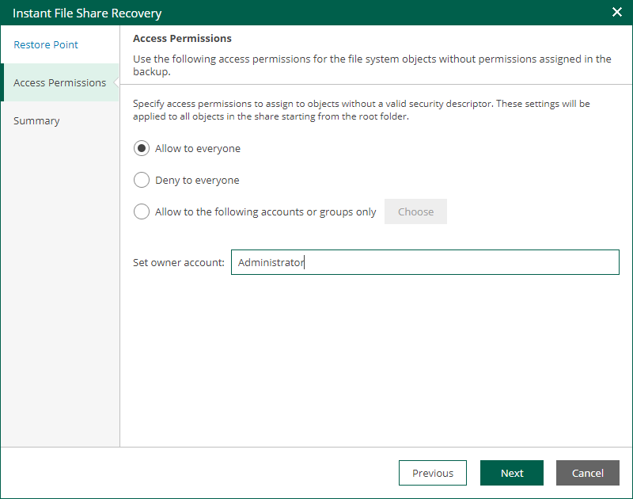

In this article

At the Access Permissions step, you can specify the owner account and permissions for the file share.

1. Configure access permissions for the file share. The following options are available:

* Allow to everyone
* Deny to everyone
* Allow to the following accounts or groups only

If you select this option, configure accounts and groups to which you want to grant permissions for accessing the file share:

1. Next to the Allow to the following accounts or groups only option, click Choose.
2. In the Accounts and Groups window, click Add to add an account or group.
3. Specify a name of the account or group and click OK.
4. Add other accounts or groups if necessary. Use the Remove button to remove an account or group.

1. In the Set owner account field, specify the owner account for the file share.

Page updated 9/4/2025

Page content applies to build 13.0.1.1071
