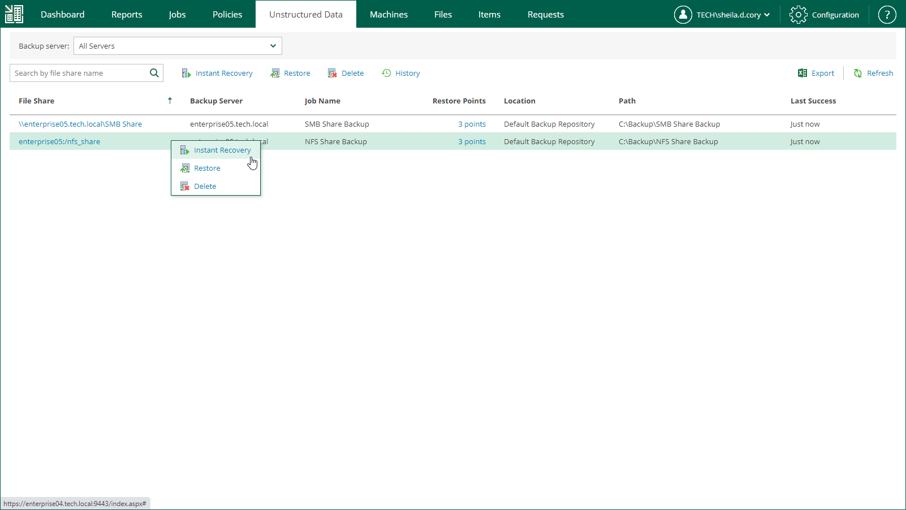

In this article

To launch the Instant File Share Recovery wizard, do the following:

1. Open the Unstructured Data tab and select a file share from the list.
2. On the toolbar, click Instant Recovery.

Alternatively, you can right-click a file share and select Instant Recovery.

Page updated 11/24/2023

Page content applies to build 13.0.1.1071
