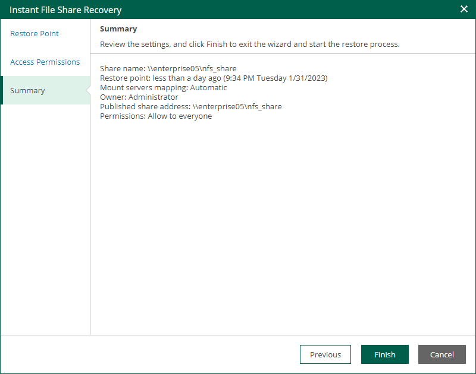

In this article

At the Summary step of the wizard, review the instant file share recovery settings and click Finish. Veeam Backup & Replication will publish the recovered file share to the mount server associated with a backup repository that stores the file share backup.

What You Do Next

After you have performed instant file share recovery, you have to finalize it. For more information, see [Finalizing Instant File Share Recovery](instant_nas_recovery_finalize.md).

Page updated 9/4/2025

Page content applies to build 13.0.1.1071
