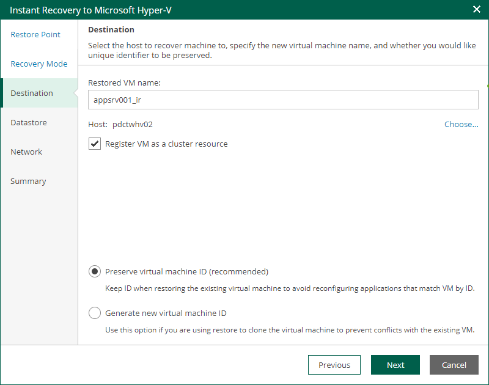

In this article

The Destination step of the wizard is available if you recover a VM to a new location or with different settings.

To configure destination settings, do the following:

1. In the Restored VM name field, specify a name under which the workload will be recovered.
2. In the Host field, specify a host on which the VM will run.
3. If the specified host is a node of a Hyper-V failover cluster, you can register the recovered VM as a cluster resource by selecting the Register VM as a cluster resource check box. If the target host is brought offline or fails for any reason, the VM will fail over to another node in the cluster.

The check box is not displayed if the host is not a cluster node.

1. Choose whether to preserve the virtual machine ID or generate a new one.

* Select Preserve virtual machine ID if the original VM no longer exists, for example, if it was deleted. In this case, it is not required to change the ID.
* Select Generate new virtual machine ID If the original workload still resides in the production environment. This will prevent conflicts.

Page updated 9/4/2025

Page content applies to build 13.0.1.1071
