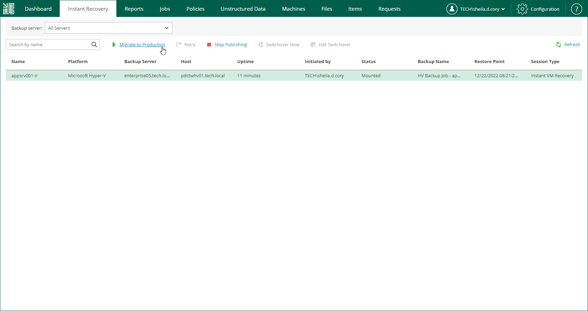

# Finalizing Instant Recovery to Microsoft Hyper-V

After you have performed instant recovery, you have to finalize the process. For this, test the recovered VMs and decide whether to migrate them to production environment or stop publishing.

Until you finalize instant recovery of all recovered VMs, a notification about running instant recovery sessions is displayed on the Dashboard tab.

Testing Recovered VM

To test a recovered VM before you migrate it to production, you can launch the VM console from Veeam Backup & Replication or open the console from the Hyper-V client. For more information, see the [Finalizing Instant Recovery to Microsoft Hyper-V](https://helpcenter.veeam.com/docs/vbr/userguide/ir_finalize_hv.html?ver=13#testing-recovered-vms) section of the Veeam Backup & Replication User Guide.

Migrating Recovered VM

When Veeam Backup & Replication migrates VMs, it transfers VM disks data to the production storage that you have selected as a destination for the recovered VMs.

|  |
| --- |
| Note |
| After the migration is finished, the original VM still remains if the destination differs from the original location. If you do not need the VM, you have to manually remove it using the Hyper-V client. |

To migrate a recovered VM to production, do the following:

1. Open the Instant Recovery tab and select the necessary Hyper-V VM from the list.
2. On the toolbar, click Migrate to production.

To view the migration progress, on the Machines tab, click History.

Unpublishing Recovered VM

If you have ensured that the VM is working and you do not need it anymore, or your tests have failed, you can stop publishing the recovered VM. This will remove the recovered VM from the storage that you selected as the destination for recovery. Note that all changes made in the recovered VM will be lost.

|  |
| --- |
| Important |
| If the destination is the original location, both the original and recovered VMs are removed. |

To remove a recovered VM, do the following:

1. Open the Instant Recovery tab and select the necessary Hyper-V VM from the list.
2. On the toolbar, click Stop Publishing.

