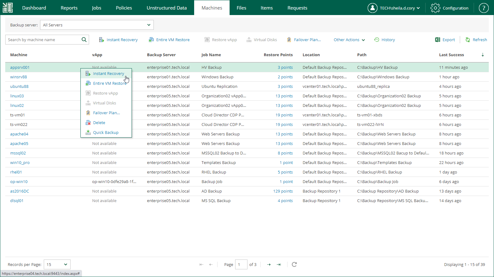

# Step 1. Launch Instant Recovery Wizard

To launch the Instant Recovery to Microsoft Hyper-V wizard, do the following:

1. On the Machines tab, select the necessary Hyper-V VM from the list.
2. On the toolbar, click Instant Recovery.

Alternatively, you can right-click the VM and select Instant Recovery.

