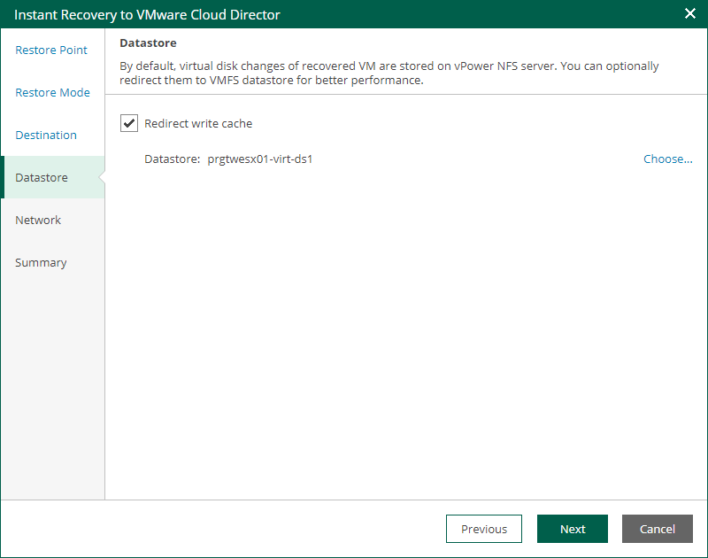

In this article

The Datastore step of the wizard is available if you recover a VM to a new location or with different settings.

At this step of the wizard, you can select where to store redo logs when a VM is running from the backup. Redo logs are auxiliary files used to keep changes that take place while the recovered VM runs.

By default, redo logs are stored in vPower NFS datastore. You can store redo logs in any datastore in the virtual environment if necessary. For more information on vPower NFS datastore, see the [vPower NFS Service](https://helpcenter.veeam.com/docs/vbr/userguide/vpower_nfs_service.html?ver=13) section of the Veeam Backup & Replication User Guide.

To redirect redo logs, do the following:

1. Select the Redirect write cache check box.
2. Click Choose and select a datastore. You can select only a datastore that is available in the organization VDC hosting the vApp to which the VM is restored.

Page updated 9/4/2025

Page content applies to build 13.0.1.1071
