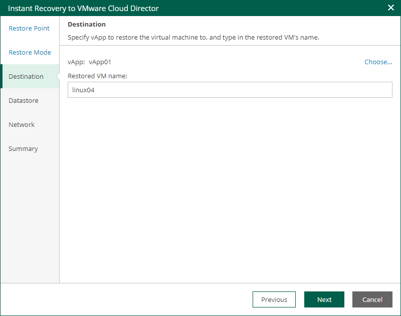

In this article

The Destination step of the wizard is available if you recover a VM to a new location or with different settings.

At this step of the wizard, you configure destination settings such as the recovered VM name and target vApp.

1. In the vApp field, specify a vApp to which the VM must be recovered. By default, the original vApp is specified.
2. In the Restored VM name field, specify a name under which the VM will be recovered. By default, the original name of the VM is used. If you are restoring the VM to the same vApp where the original VM is registered and the original VM still resides there, change the VM name to avoid conflicts.

Page updated 9/4/2025

Page content applies to build 13.0.1.1071
