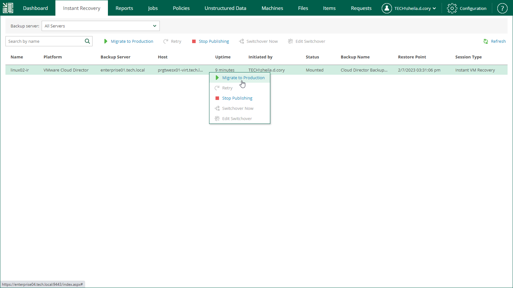
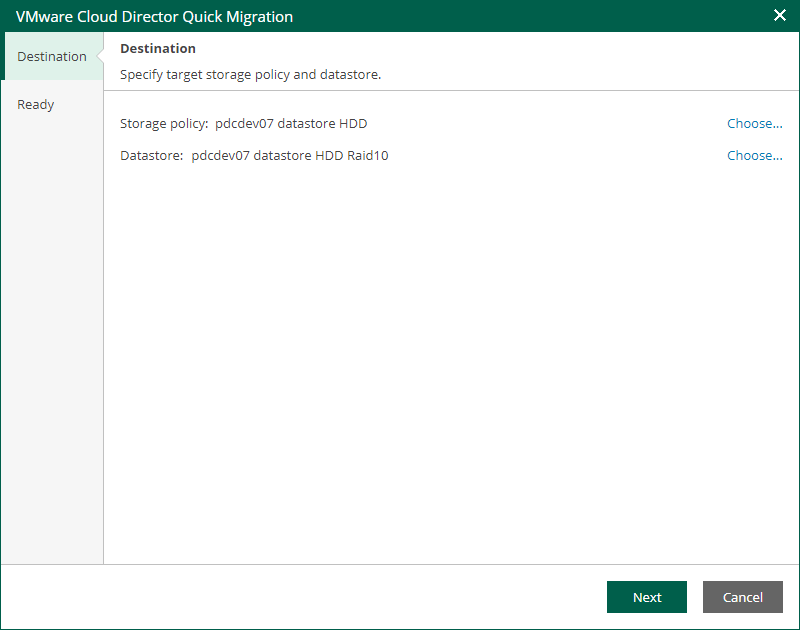
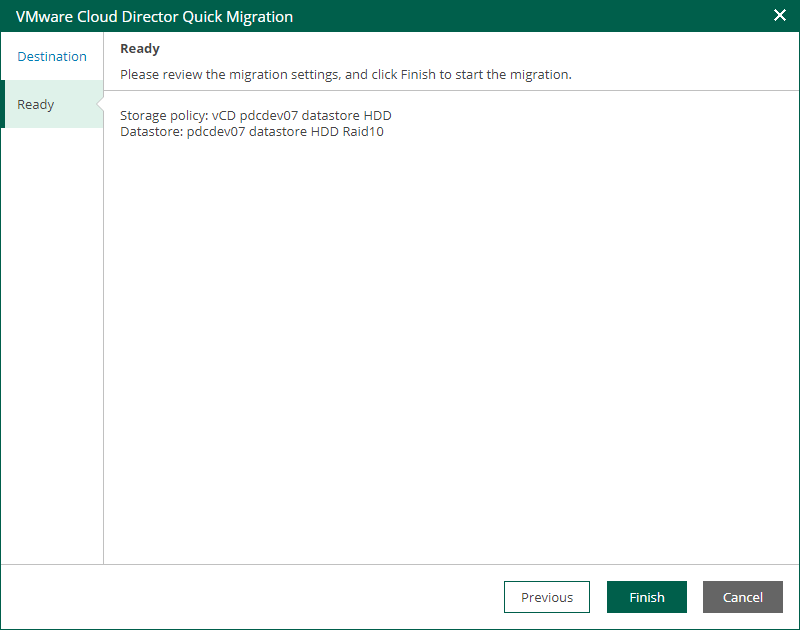
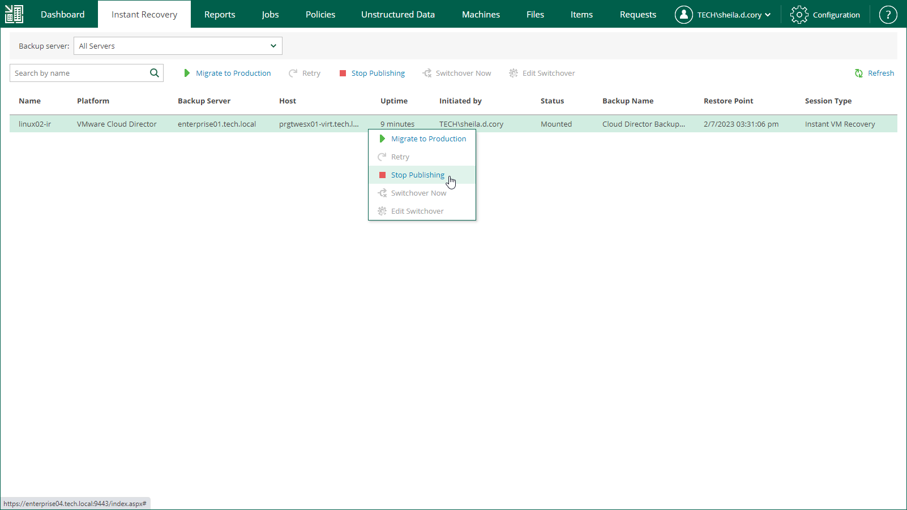

# Finalizing Instant Recovery to VMware Cloud Director

After you have performed instant recovery, you have to finalize the process. For this, test the recovered VMs and decide whether to migrate them to production environment or stop publishing.

Until you finalize instant recovery of all recovered VMs, a notification about running instant recovery sessions is displayed on the Dashboard tab.

Testing Recovered VM

To test a recovered VM before you migrate it to production, you can launch the VMware Remote Console software from the Veeam Backup & Replication console. For more information, see the [Finalizing Instant Recovery to VMware vSphere](https://helpcenter.veeam.com/docs/vbr/userguide/vcloud_instant_to_vcd_finalize.html?ver=13#test) section of the Veeam Backup & Replication User Guide.

Migrating Recovered VM

If a VM is recovered successfully, you can migrate it to the production environment.

To migrate a recovered VM to production, do the following:

1. Open the Instant Recovery tab and select the necessary VMware Cloud Director VM from the list.
2. On the toolbar, click Migrate to production.

1. At the Destination step of the VMware Cloud Director Quick Migration wizard, specify a VM storage policy and a datastore. You can choose from the storage policies and datastores that are available in the organization VDC hosting the vApp to which the VM is recovered.

1. At the Ready step of the wizard, review migration settings and click Finish.

To view the migration progress, on the Machines tab, click History.

Unpublishing Recovered VM

If your tests have failed, you can stop publishing the recovered VM. This will remove the recovered VM from the host that you selected as the destination for recovery. Note that all changes made in the recovered VMs will be lost.

To remove a recovered VM, do the following:

1. Open the Instant Recovery tab and select the necessary VMware Cloud Director VM from the list.
2. On the toolbar, click Stop Publishing.

