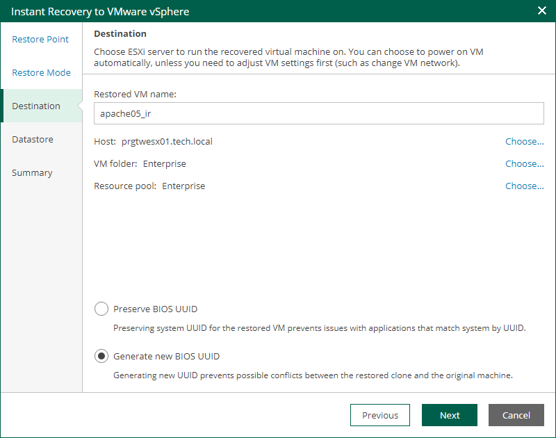

In this article

The Destination step of the wizard is available if you recover a VM to a new location or with different settings.

At this step of the wizard, you configure destination settings such as the recovered VM name, target host, VM folder and so on.

1. In the Restored VM name field, specify a name under which the workload will be recovered.
2. In the Host field, specify a host on which the VM will run.
3. In the VM folder field, specify a folder to which the recovered VM files will be placed.
4. In the Resource pool field, specify a resource pool to which the VM will be placed.
5. Choose whether to preserve the BIOS UUID or generate a new BIOS UUID.

If the original workload still resides in the production environment, select the Generate new BIOS UUID option to prevent conflicts. The BIOS UUID change is not required if the original VM no longer exists, for example, if it was deleted.

Page updated 9/4/2025

Page content applies to build 13.0.1.1071
