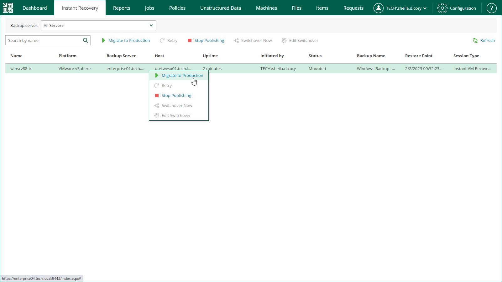
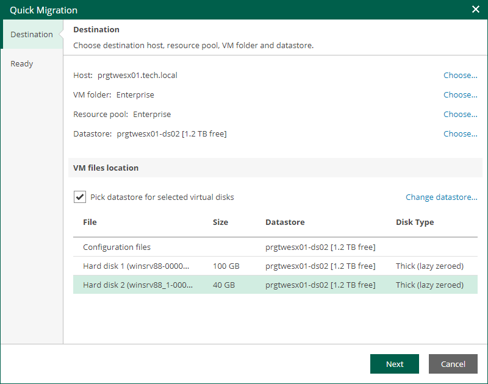
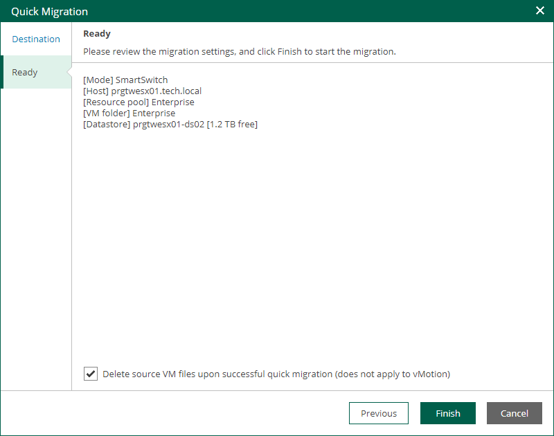
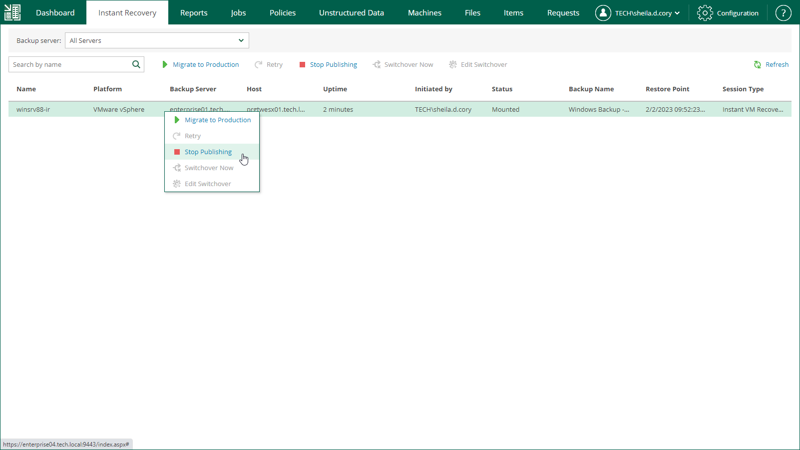

In this article

After you have performed instant recovery, you have to finalize the process. For this, test the recovered VMs and decide whether to migrate them to production environment or stop publishing.

Until you finalize instant recovery of all recovered VMs, a notification about running instant recovery sessions is displayed on the Dashboard tab.

Testing Recovered VM

To test a recovered VM before you migrate it to production, you can launch the VMware Remote Console software from the Veeam Backup & Replication console. For more information, see the [Finalizing Instant Recovery to VMware vSphere](https://helpcenter.veeam.com/docs/vbr/userguide/instant_recovery_review_vm.html?ver=13#testing-recovered-vms) section of the Veeam Backup & Replication User Guide.

Migrating Recovered VM

If a VM is recovered successfully, you can migrate it to the production environment.

To migrate a recovered VM to production, do the following:

1. Open the Instant Recovery tab and select the necessary VMware vSphere VM from the list.
2. On the toolbar, click Migrate to production.

1. At the Destination step of the VMware Cloud Director Quick Migration wizard, specify destination where you want to migrate the VM.

1. Click Choose next to the Host field and select an ESXi host or cluster where the relocated VM must be registered.
2. Click Choose next to the VM folder field and select the target VM folder.
3. Click Choose next to the Resource pool field and select the target resource pool.
4. Click Choose next to the Datastore field and select the target datastore.

If you want to change the target datastore for the VM configuration files or disk files, do the following:

1. Select the Pick datastore for selected virtual disks check box.
2. Select the configuration files or one of the hard disks and click Change datastore.
3. In the Add objects window, choose the necessary datastore and click OK.

1. At the Ready step of the wizard, review migration settings click Finish.

To view the migration progress, on the Machines tab, click History.

Unpublishing Recovered VM

If your tests have failed, you can stop publishing the recovered VM. This will remove the recovered VM from the host that you selected as the destination for recovery. Note that all changes made in the recovered VMs will be lost.

To remove a recovered VM, do the following:

1. Open the Instant Recovery tab and select the necessary VMware vSphere VM from the list.
2. On the toolbar, click Stop Publishing.

Page updated 11/10/2025

Page content applies to build 13.0.1.1071
