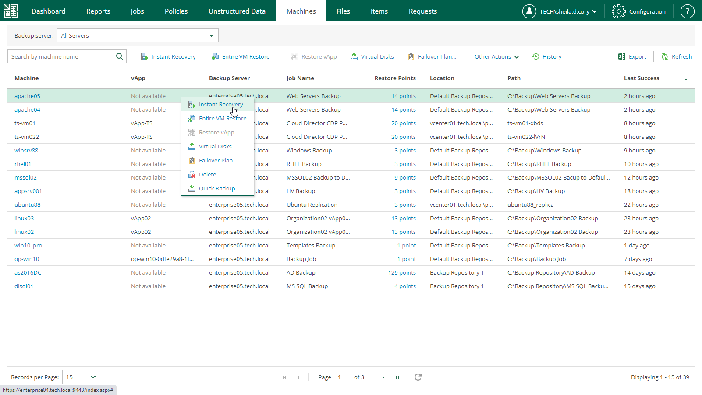

In this article

To launch the Instant Recovery to VMware vSphere wizard, do the following:

1. On the Machines tab, select the necessary VMware vSphere VM from the list.
2. On the toolbar, click Instant Recovery.

Alternatively, you can right-click the VM and select Instant Recovery.

Page updated 9/2/2025

Page content applies to build 13.0.1.1071
